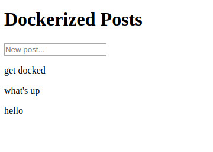

Imagine you're working on a project which includes a PostgreSQL database, Redis cache layer, Elasticsearch engine, Consul for dynamic configuration, and more. The last thing you want is to install all of these services on your local machine during development.

Enter Docker.

[Docker](https://www.docker.com/) is a tool for working with containers, which are isolated spaces where apps can run. It enables painless installation of services and sharing development environments with others. The same applies for production, amongst many other [benefits](https://dzone.com/articles/5-key-benefits-docker-ci).

# Getting started

Install [Docker](https://docs.docker.com/engine/installation/) and
[Docker Compose](https://docs.docker.com/compose/install/).

# Basic example

Lets say you need a MySQL database. Simply run the following command.

```bash {commandLine}
docker run --name database -p 3306:3306 -e MYSQL_ROOT_PASSWORD=1234 -d mysql
```

This creates a container named `database` running a MySQL instance on port 3306. Environment variable `MYSQL_ROOT_PASSWORD` holds the root user's password.

To get container's IP address, run the following command.

```bash {commandLine}
docker inspect -f '{{range .NetworkSettings.Networks}}{{.IPAddress}}{{end}}' database
```

You can use MySQL CLI tool like this.

```bash {commandLine}
docker exec -it database mysql -u root -p
```

You could then run another container, with a different version of MySQL server, on port 3307 by specifying a tag.

```bash {commandLine}
docker run --name database2 -p 3307:3306 -e MYSQL_ROOT_PASSWORD=1234 -d mysql:5.6
```

To find all available Docker images visit [Docker Hub](https://hub.docker.com/).

# Using Docker Compose

This section shows how to set up a hypothetical development environment involving a MongoDB database, a back-end service in Go and a static frontend site. The end product is a website, which displays anonymous posts.

## MongoDB

Inside project's root directory create a `docker-compose.yaml` file with the following content.

```yaml
version: '3.3'
services:
  mongo:
    image: 'mongo:latest'
    container_name: 'mongo'
    ports:
      - '27100:27017'
```

This defines a MongoDB service called `mongo`.

In the same directory run this command to build it.

```bash {commandLine}
docker-compose up -d --build
```

Or by specifying the location of `docker-compose.yaml` file.

```bash {commandLine}
docker-compose up -d --build -f ./docker-compose.yaml
```

List currently running containers.

```bash {commandLine:2-4}
docker-compose ps
Name              Command             State            Ports
----------------------------------------------------------------------
mongo   docker-entrypoint.sh mongod   Up      0.0.0.0:27100->27017/tcp
```

## Web service in Go

Define another service inside `docker-compose.yaml`, which depends on `mongo`.

```yaml {highlight:3-11}
version: '3.3'
services:
  api:
    container_name: 'api'
    build: './api'
    ports:
      - '8080:8080'
    volumes:
      - './api:/go/src/app'
    depends_on:
      - 'mongo'
  mongo:
    image: 'mongo:latest'
    container_name: 'mongo'
    ports:
      - '27100:27017'
```

The `api` service will be built using a custom "Dockerfile". Create it inside `api` directory. Name it exactly `Dockerfile`, without an extension.

```docker
FROM golang:1.8

WORKDIR /go/src/app
COPY . .

RUN go get github.com/pilu/fresh
RUN go-wrapper download
RUN go-wrapper install

CMD [ "fresh" ]
```

This Dockerfile extends official [golang](https://hub.docker.com/_/golang/) image, installs the [pilu/fresh](https://github.com/pilu/fresh) package and all other dependencies using `go-wrapper` utility commands. The default command is set to `fresh`. This will enable live reloading for development.

Create `main.go` file inside `api` directory.

```go
package main

import (
  "encoding/json"
  "io/ioutil"
  "log"
  "net/http"
  "os"
  "time"
  "github.com/rs/cors"
  "github.com/gorilla/mux"
  "gopkg.in/mgo.v2"
)

type Post struct {
  Text      string    `json:"text" bson:"text"`
  CreatedAt time.Time `json:"createdAt" bson:"created_at"`
}

var posts *mgo.Collection

func main() {
  // Connect to mongo
  session, err := mgo.Dial("mongo:27017")
  if err != nil {
    log.Fatalln(err)
    log.Fatalln("mongo err")
    os.Exit(1)
  }
  defer session.Close()
  session.SetMode(mgo.Monotonic, true)
  // Get posts collection
  posts = session.DB("app").C("posts")

  // Set up routes
  r := mux.NewRouter()
  r.HandleFunc("/posts", createPost).
    Methods("POST")
  http.ListenAndServe(":8080", cors.AllowAll().Handler(r))
  log.Println("Listening on port 8080...")
}

func createPost(w http.ResponseWriter, r *http.Request) {
  // Read body
  data, err := ioutil.ReadAll(r.Body)
  if err != nil {
    responseError(w, err.Error(), http.StatusBadRequest)
    return
  }
  // Read post
  post := &Post{}
  err = json.Unmarshal(data, post)
  if err != nil {
    responseError(w, err.Error(), http.StatusBadRequest)
    return
  }
  post.CreatedAt = time.Now().UTC()
  // Insert new post
  if err := posts.Insert(post); err != nil {
    responseError(w, err.Error(), http.StatusInternalServerError)
    return
  }
  responseJSON(w, post)
}

func responseError(w http.ResponseWriter, message string, code int) {
  w.Header().Set("Content-Type", "application/json")
  w.WriteHeader(code)
  json.NewEncoder(w).Encode(map[string]string{"error": message})
}

func responseJSON(w http.ResponseWriter, data interface{}) {
  w.Header().Set("Content-Type", "application/json")
  json.NewEncoder(w).Encode(data)
}
```

Rebuild containers.

```bash {commandLine}
docker-compose up -d --build
```

Try calling the `/posts` endpoint.

```bash {commandLine}
curl localhost:8080/posts -d '{"text":"hello"}'
```

Declare a new handler which reads all posts.

```go
func readPosts(w http.ResponseWriter, r *http.Request) {
  result := []Post{}
  if err := posts.Find(nil).Sort("-created_at").All(&result); err != nil {
    responseError(w, err.Error(), http.StatusInternalServerError)
  } else {
    responseJSON(w, result)
  }
}
```

Hook it up inside the `main` function.

```go
r.HandleFunc("/posts", readPosts).
  Methods("GET")
```

Without rebuilding containers, you should be able to call this endpoint.

```bash {commandLine}
curl localhost:8080/posts
```

## Serving a static site with NGINX

Declare a new service inside `docker-compose.yaml` file called `web`.

```yaml
web:
  container_name: 'web'
  image: 'nginx:latest'
  ports:
    - '8081:80'
  volumes:
    - './web:/usr/share/nginx/html'
  depends_on:
    - 'api'
```

Create a `Dockerfile` inside `web` directory.

```dockerfile
FROM nginx
COPY . /usr/share/nginx/html
```

Create the `index.html` file.

```html
<!DOCTYPE html>
<html>
  <head>
    <meta charset="utf-8" />
    <title>Dockerized Posts</title>
    <script src="https://ajax.googleapis.com/ajax/libs/jquery/3.2.1/jquery.min.js"></script>
  </head>
  <body>
    <h1>Dockerized Posts</h1>
    <form id="form">
      <input type="text" placeholder="New post..." id="post-input" />
    </form>
    <div id="posts"></div>
    <script>
      $(document).ready(function () {
        $.get('http://localhost:8080/posts', function (posts) {
          $list = $('#posts');
          for (var i = 0; i < posts.length; i++) {
            $list.append('<p>' + posts[i].text + '</p>');
          }
        });
        $('#form').submit(function (event) {
          event.preventDefault();
          var text = $('#post-input').val();
          $.post(
            'http://localhost:8080/posts',
            JSON.stringify({ text: text }),
            function () {
              location.reload();
            },
          );
        });
      });
    </script>
  </body>
</html>
```

Now build it.

```bash {commandLine}
docker-compose up -d --build
```

Navigate to [http://localhost:8081/](http://localhost:8081/) with your browser and try creating a few posts.



## Testing

Here's how you can run Go tests. Inside `api` create `sanity_test.go` test file.

```go
package main

import "testing"

func TestSanity(t *testing.T) {
  t.Log("Has sanity")
}
```

Then run `go test -v` inside `api` container.

```bash {commandLine:2-6}
docker-compose run api go test -v
=== RUN   TestSanity
--- PASS: TestSanity (0.00s)
        sanity_test.go:6: Has sanity
PASS
ok      app     0.004s
```

If you need a temporary database during testing, you could simply define another service.

# Conclusion

These were just a couple of examples of why the world of containers is awesome. If you haven't already, give Docker a try. If not for production use, at least during development, because managing local installations of services is extremely unpleasant.

Get source code for the Docker Compose example on [GitHub](https://github.com/tinrab/go-mongo-docker-example).
