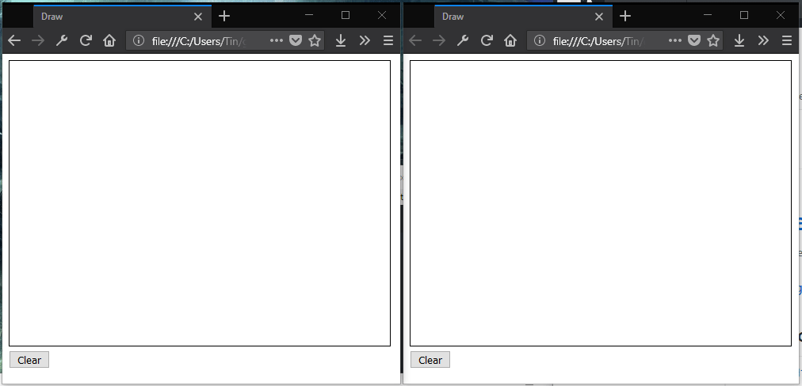

This article shows how to build a simple drawing app using Go for the back-end. All communication will be established with WebSockets, so users will be able to see each others' drawings in real-time.

Source code is available on [GitHub](https://github.com/tinrab/go-realtime-collaborative-drawing-app).

# Getting started

Install necessary Go packages.

```bash{outputLines:2-4}
go get -u github.com/gorilla/websocket \
  github.com/lucasb-eyer/go-colorful \
  github.com/tidwall/gjson \
  github.com/satori/go.uuid
```

Create a directory for your project inside `$GOPATH`.

# Server

First, you'll create the server. Server consists of a Hub which handles clients' lifecycle and manages received messages. This solution is similar to Gorilla's [chat](https://github.com/gorilla/websocket/tree/master/examples/chat) example.

## Client struct

Create `client.go` file.

```go
package main

import (
  "github.com/gorilla/websocket"
  uuid "github.com/satori/go.uuid"
)

type Client struct {
  id       string
  hub      *Hub
  color    string
  socket   *websocket.Conn
  outbound chan []byte
}
```

Write a constructor function for the client. It assigns an UUID and a random color.

```go
func newClient(hub *Hub, socket *websocket.Conn) *Client {
  return &Client{
    id:       uuid.NewV4().String(),
    color:    generateColor(),
    hub:      hub,
    socket:   socket,
    outbound: make(chan []byte),
  }
}
```

Write the `generateColor` utility function inside `utilities.go` file.

```go
package main

import (
  "math/rand"
  "time"
  colorful "github.com/lucasb-eyer/go-colorful"
)

func init() {
  rand.Seed(time.Now().UnixNano())
}

func generateColor() string {
  c := colorful.Hsv(rand.Float64()*360.0, 0.8, 0.8)
  return c.Hex()
}
```

Write the `read` function, which reads messages sent from clients and forwards them to the hub. The client will be sent to the unregistered channel, if there's an error or if it disconnects.

```go
func (client *Client) read() {
  defer func() {
    client.hub.unregister <- client
  }()
  for {
    _, data, err := client.socket.ReadMessage()
    if err != nil {
      break
    }
    client.hub.onMessage(data, client)
  }
}
```

The `write` function takes messages from the `outbound` channel and sends them to the client. This way, the server will be able to send messages to a client.

```go
func (client *Client) write() {
  for {
    select {
    case data, ok := <-client.outbound:
      if !ok {
        client.socket.WriteMessage(websocket.CloseMessage, []byte{})
        return
      }
      client.socket.WriteMessage(websocket.TextMessage, data)
    }
  }
}
```

Write functions that start and end processing of the client. Run both `read` and `write` functions as goroutines.

```go
func (client Client) run() {
  go client.read()
  go client.write()
}

func (client Client) close() {
  client.socket.Close()
  close(client.outbound)
}
```

## Hub struct

Declare `Hub` struct inside `hub.go`.

```go
package main

import (
  "encoding/json"
  "log"
  "net/http"

  "github.com/gorilla/websocket"
  "github.com/tidwall/gjson"
)

type Hub struct {
  clients    []*Client
  register   chan *Client
  unregister chan *Client
}
```

Write the constructor function.

```go
func newHub() *Hub {
  return &Hub{
    clients:    make([]*Client, 0),
    register:   make(chan *Client),
    unregister: make(chan *Client),
  }
}
```

Write `run` function.

```go
func (hub *Hub) run() {
  for {
    select {
    case client := <-hub.register:
      hub.onConnect(client)
    case client := <-hub.unregister:
      hub.onDisconnect(client)
    }
  }
}
```

Write a HTTP handler to upgrade the request to a WebSockets request. If upgrade succeeds, the client is added to the list of clients.

```go
var upgrader = websocket.Upgrader{
  // Allow all origins
  CheckOrigin: func(r *http.Request) bool { return true },
}

func (hub *Hub) handleWebSocket(w http.ResponseWriter, r *http.Request) {
  socket, err := upgrader.Upgrade(w, r, nil)
  if err != nil {
    log.Println(err)
    http.Error(w, "could not upgrade", http.StatusInternalServerError)
    return
  }
  client := newClient(hub, socket)
  hub.clients = append(hub.clients, client)
  hub.register <- client
  client.run()
}
```

Write a function which sends a message to a client.

```go
func (hub *Hub) send(message interface{}, client *Client) {
  data, _ := json.Marshal(message)
  client.outbound <- data
}
```

Write a function which broadcasts a message to all clients, except one. This is useful for forwarding received messages to other clients, while excluding the sender.

```go
func (hub *Hub) broadcast(message interface{}, ignore *Client) {
  data, _ := json.Marshal(message)
  for _, c := range hub.clients {
    if c != ignore {
      c.outbound <- data
    }
  }
}
```

## Messages

Messages will use JSON as the wire format. Each message will carry a "kind" field, to distinguish messages from one another.

Create a `message` subpackage and `messages.go` file inside it.

Declare an enum of all message "kinds".

```go
package message

const (
  // KindConnected is sent when user connects
  KindConnected = iota + 1
  // KindUserJoined is sent when someone else joins
  KindUserJoined
  // KindUserLeft is sent when someone leaves
  KindUserLeft
  // KindStroke message specifies a drawn stroke by a user
  KindStroke
  // KindClear message is sent when a user clears the screen
  KindClear
)
```

Declare some plain data structs.

```go
type Point struct {
  X int `json:"x"`
  Y int `json:"y"`
}

type User struct {
  ID    string `json:"id"`
  Color string `json:"color"`
}
```

Declare message struct and write helper constructor functions where needed. The `kind` fields are set inside constructors.

```go
type Connected struct {
  Kind  int    `json:"kind"`
  Color string `json:"color"`
  Users []User `json:"users"`
}

func NewConnected(color string, users []User) *Connected {
  return &Connected{
    Kind:  KindConnected,
    Color: color,
    Users: users,
  }
}

type UserJoined struct {
  Kind int  `json:"kind"`
  User User `json:"user"`
}

func NewUserJoined(userID string, color string) *UserJoined {
  return &UserJoined{
    Kind: KindUserJoined,
    User: User{ID: userID, Color: color},
  }
}

type UserLeft struct {
  Kind   int    `json:"kind"`
  UserID string `json:"userId"`
}

func NewUserLeft(userID string) *UserLeft {
  return &UserLeft{
    Kind:   KindUserLeft,
    UserID: userID,
  }
}

type Stroke struct {
  Kind   int     `json:"kind"`
  UserID string  `json:"userId"`
  Points []Point `json:"points"`
  Finish bool    `json:"finish"`
}

type Clear struct {
  Kind   int    `json:"kind"`
  UserID string `json:"userId"`
}
```

## Handling message flow

Back in the `hub.go` file, add all the missing functions.

The `onConnect` function is called from `run` when a client connects. It sends user's color and information about other users to the client. It also notifies others that someone joined.

```go
func (hub *Hub) onConnect(client *Client) {
  log.Println("client connected: ", client.socket.RemoteAddr())
  // Make list of all users
  users := []message.User{}
  for _, c := range hub.clients {
    users = append(users, message.User{ID: c.id, Color: c.color})
  }
  // Notify user joined
  hub.send(message.NewConnected(client.color, users), client)
  hub.broadcast(message.NewUserJoined(client.id, client.color), client)
}
```

The `onDisconnect` function removes disconnected client from the list of all clients and notifies others that somebody left.

```go
func (hub *Hub) onDisconnect(client *Client) {
  log.Println("client disconnected: ", client.socket.RemoteAddr())
  client.close()
  // Find index of client
  i := -1
  for j, c := range hub.clients {
    if c.id == client.id {
      i = j
      break
    }
  }
  // Delete client from list
  copy(hub.clients[i:], hub.clients[i+1:])
  hub.clients[len(hub.clients)-1] = nil
  hub.clients = hub.clients[:len(hub.clients)-1]
  // Notify user left
  hub.broadcast(message.NewUserLeft(client.id), nil)
}
```

The `onMessage` function is called whenever a message is received from a client. First it reads what kind of a message it is, by using [tidwall/gjson](https://github.com/tidwall/gjson) package, then handles each case separately.

In this example, both cases work similarly. Each message gets ID of the user, and then is forwarded to other clients.

```go
func (hub *Hub) onMessage(data []byte, client *Client) {
  kind := gjson.GetBytes(data, "kind").Int()
  if kind == message.KindStroke {
    var msg message.Stroke
    if json.Unmarshal(data, &msg) != nil {
      return
    }
    msg.UserID = client.id
    hub.broadcast(msg, client)
  } else if kind == message.KindClear {
    var msg message.Clear
    if json.Unmarshal(data, &msg) != nil {
      return
    }
    msg.UserID = client.id
    hub.broadcast(msg, client)
  }
}
```

To finish off the server-side code, run the server inside `main.go` file.

```go
package main

import (
  "log"
  "net/http"
)

func main() {
  hub := newHub()
  go hub.run()
  http.HandleFunc("/ws", hub.handleWebSocket)
  err := http.ListenAndServe(":3000", nil)
  if err != nil {
    log.Fatal(err)
  }
}
```

# Front-end app

The front-end app will be written in pure JavaScript. Create `client` directory and `index.html` file inside it.

```html
<!DOCTYPE html>
<html>
<head>
  <title>Collaborative Drawing App</title>
  <style>
    #canvas {
      border: 1px solid #000;
    }
  </style>
</head>
<body>
  <canvas id="canvas"
          width="480"
          height="360">
  </canvas>
  <div>
    <button id="clearButton">Clear</button>
  </div>
  <script>
    MESSAGE_CONNECTED = 1;
    MESSAGE_USER_JOINED = 2;
    MESSAGE_USER_LEFT = 3;
    MESSAGE_STROKE = 4;
    MESSAGE_CLEAR = 5;

    window.onload = function () {}
  </script>
</body>
</html>
```

This creates a canvas and a button to clear it. All of the following JavaScript code resides inside `window.onload` event handler.

## Drawing on canvas

Declare some variables.

```js
var canvas = document.getElementById('canvas');
var ctx = canvas.getContext("2d");
var isDrawing = false;
var strokeColor = '';
var strokes = [];
```

Write event handlers for the canvas.

```js
canvas.onmousedown = function (event) {
  isDrawing = true;
  addPoint(event.pageX - this.offsetLeft, event.pageY - this.offsetTop, true);
};

canvas.onmousemove = function (event) {
  if (isDrawing) {
    addPoint(event.pageX - this.offsetLeft, event.pageY - this.offsetTop);
  }
};

canvas.onmouseup = function () {
  isDrawing = false;
};

canvas.onmouseleave = function () {
  isDrawing = false;
};
```

Write `addPoint` function. `strokes` is an array of strokes, each being an array of points.

```js
function addPoint(x, y, newStroke) {
  var p = { x: x, y: y };
  if (newStroke) {
    strokes.push([p]);
  } else {
    strokes[strokes.length - 1].push(p);
  }
  update();
}
```

The `update` function redraws everything on the canvas.

```js
function update() {
  ctx.clearRect(0, 0, ctx.canvas.width, ctx.canvas.height);
  ctx.lineJoin = 'round';
  ctx.lineWidth = 4;

  ctx.strokeStyle = strokeColor;
  drawStrokes(strokes);
}
```

Write `drawStrokes` function which draws multiple strokes.

```js
function drawStrokes(strokes) {
  for (var i = 0; i < strokes.length; i++) {
    ctx.beginPath();
    for (var j = 1; j < strokes[i].length; j++) {
      var prev = strokes[i][j - 1];
      var current = strokes[i][j];
      ctx.moveTo(prev.x, prev.y);
      ctx.lineTo(current.x, current.y);
    }
    ctx.closePath();
    ctx.stroke();
  }
}
```

Write an `onclick` handler for the clear button.

```js
document.getElementById('clearButton').onclick = function () {
  strokes = [];
  update();
};
```

## Server communication

To communicate with the server, first declare some additional variables.

```js
var socket = new WebSocket("ws://localhost:3000/ws");
var otherColors = {};
var otherStrokes = {};
```

The `otherColors` object will hold other clients' colors, where keys will be their IDs. And the `otherStrokes` will hold drawing data.

Update `addPoint` function to send a message. For this example, `points` array has only one point. Ideally, points would be sent in batches based on some criteria.

```js
function addPoint(x, y, newStroke) {
  var p = { x: x, y: y };
  if (newStroke) {
    strokes.push([p]);
  } else {
    strokes[strokes.length - 1].push(p);
  }
// highlight-next-line
  socket.send(JSON.stringify({ kind: MESSAGE_STROKE, points: [p], finish: newStroke }));
  update();
}
```

Send a "clear" message in the clear handler.

```js
document.getElementById('clearButton').onclick = function () {
  strokes = [];
// highlight-next-line
  socket.send(JSON.stringify({ kind: MESSAGE_CLEAR }));
  update();
};
```

Now write `onmessage` handler to handle received messages.

```js
socket.onmessage = function (event) {
  var messages = event.data.split('\n');
  for (var i = 0; i < messages.length; i++) {
    var message = JSON.parse(messages[i]);
    onMessage(message);
  }
};

function onMessage(message) {
  switch (message.kind) {
    case MESSAGE_CONNECTED:
      break;
    case MESSAGE_USER_JOINED:
      break;
    case MESSAGE_USER_LEFT:
      break;
    case MESSAGE_STROKE:
      break;
    case MESSAGE_CLEAR:
      break;
  }
}
```

For `MESSAGE_CONNECTED` case, set the user's stroke color and populate "other" objects with given information.

```js
strokeColor = message.color;
for (var i = 0; i < message.users.length; i++) {
  var user = message.users[i];
  otherColors[user.id] = user.color;
  otherStrokes[user.id] = [];
}
```

For `MESSAGE_USER_JOINED` case, set the user's color and prepare an empty stroke array.

```js
otherColors[message.user.id] = message.user.color;
otherStrokes[message.user.id] = [];
```

If somebody leaves, delete his data in the `MESSAGE_USER_LEFT` case and clear his drawings from the canvas.

```js
delete otherColors[message.userId];
delete otherStrokes[message.userId];
update();
```

Inside `MESSAGE_STROKE` case, update the strokes array for a user.

```js
if (message.finish) {
  otherStrokes[message.userId].push(message.points);
} else {
  var strokes = otherStrokes[message.userId];
  strokes[strokes.length - 1] = strokes[strokes.length - 1].concat(message.points);
}
update();
```

For `MESSAGE_CLEAR` case, simply clear the user's stroke array.

```js
otherStrokes[message.userId] = [];
update();
```

Update the `update` function to display others' drawings.

```js
function update() {
  ctx.clearRect(0, 0, ctx.canvas.width, ctx.canvas.height);
  ctx.lineJoin = 'round';
  ctx.lineWidth = 4;
  // Draw mine
  ctx.strokeStyle = strokeColor;
  drawStrokes(strokes);
  // Draw others'
  var userIds = Object.keys(otherColors);
  for (var i = 0; i < userIds.length; i++) {
    var userId = userIds[i];
    ctx.strokeStyle = otherColors[userId];
    drawStrokes(otherStrokes[userId]);
  }
}
```

# Wrapping up

To run your app, buld and run the server.

```bash
go build -o server && ./server
```

Then open `client/index.html` file in your browser.



Source code is available on [GitHub](https://github.com/tinrab/go-realtime-collaborative-drawing-app).
