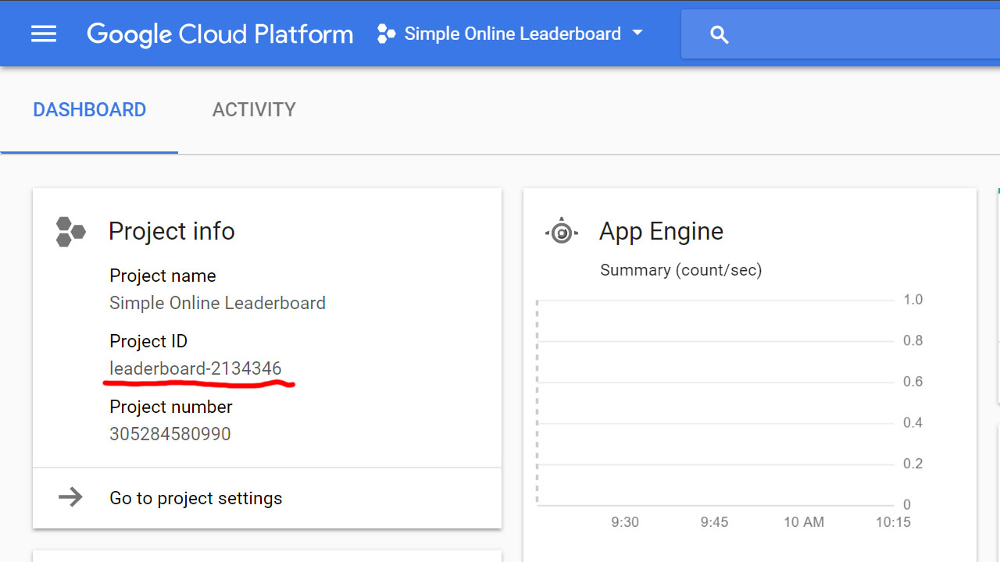

If you want your game to have an online leaderboards and you're developing a mobile game, then you'd probably want to use Play Games Services (Android) or Game Center (iOS). For desktop games, you might use Steam's leaderboards with Steamworks SDK. But if you want more control, you have to create your own system. This article shows one of the ways of achieving that.

The way this leaderboard works, is that each player can submit their score by specifying their own name and a password. If another player with the same name already exists, then both passwords must match. The name must be at least 3 and below 24 characters, and from 5 to 24 for the password. This can be changed in the source code.

To start, install Google [Cloud SDK](https://cloud.google.com/sdk/downloads) along with `google-cloud-sdk-app-engine-go` component.

Create a new project on Google Cloud [Console](https://console.cloud.google.com) and note the project's ID. The leaderboard service will run as an App Engine application, which is free to use below certain quotas (see [pricing](https://cloud.google.com/appengine/pricing)).



# Deploy the leaderboard service

Clone or download [tinrab/simple-online-leaderboard](https://github.com/tinrab/simple-online-leaderboard) repository.

```
$ git clone https://github.com/tinrab/simple-online-leaderboard
```

Navigate to the `simple-online-leaderboard` folder and deploy the service using `gcloud` command. Replace the `PROJECT_ID` with your own ID.

```
$ cd simple-online-leaderboard
$ gcloud app deploy . --project=$PROJECT_ID
```

Your leaderboard service should now be available at `https://[PROJECT_ID].appspot.com`.

To post a new score, you can issue an HTTP POST request.

```
$ curl -x POST "https://[PROJECT_ID].appspot.com/api/scores?name=Lambert&score=42&password=12345"
```

Get all scores with this request.

```
$ curl "https://[PROJECT_ID].appspot.com/api/scores?skip=0&take=3"
```

The response will look similar to this. Scores will be sorted from highest to lowest.

```json
{
  "data": [
    {
      "name": "Blinn",
      "score": "53"
    },
    {
      "name": "Lambert",
      "score": "42"
    },
    {
      "name": "Phong",
      "score": "24"
    }
  ]
}
```

The `skip` parameter tells how many records to skip, and `take` the maximum number of records to return.

# Unreal Engine project

Inside your UE4 C++ project, locate the `[PROJECT_NAME].Build.cs` file and add the following dependencies.

```csharp{6-8}
PublicDependencyModuleNames.AddRange(new string[] {
    "Core",
    "CoreUObject",
    "Engine",
    "InputCore",
    "Http",
    "Json",
    "JsonUtilities"
});
```

Create a C++ class called `LeaderboardClient`. Open `LeaderboardClient.h` and declare some structs to hold the response data.

```cpp
#pragma once

#include "CoreMinimal.h"
#include "GameFramework/Info.h"
#include "Runtime/Online/HTTP/Public/Http.h"
#include "LeaderboardClient.generated.h"

USTRUCT()
struct FPlayerScore
{
  GENERATED_BODY()

  UPROPERTY()
  FString Name;

  UPROPERTY()
  FString Score;
};

USTRUCT()
struct FGetScoresResult
{
  GENERATED_BODY()

  UPROPERTY()
  TArray<FPlayerScore> Data;

  FGetScoresResult() {}
};
```

Declare delegates which will be used to call functions on request completion.

```cpp
DECLARE_DELEGATE_TwoParams(FGetScoresCompleteDelegate, FGetScoresResult, bool);
DECLARE_DELEGATE_OneParam(FPostScoreCompleteDelegate, bool);
```

Declare the `ALeaderboardClient` class. This will be a singleton with all the necessary middleware functions between your game and leaderboard service.

```cpp
UCLASS()
class SIMPLELEADERBOARD_API ALeaderboardClient : public AInfo
{
  GENERATED_BODY()

private:
  static const FString URL;

  static ALeaderboardClient* Instance;

  FGetScoresCompleteDelegate GetScoresCompleteDelegate;
  FPostScoreCompleteDelegate PostScoreCompleteDelegate;

  void OnGetScoresRequestComplete(FHttpRequestPtr Request, FHttpResponsePtr Response, bool bSuccess);
  void OnPostScoreRequestComplete(FHttpRequestPtr Request, FHttpResponsePtr Response, bool bSuccess);

public:
  ALeaderboardClient();

  static ALeaderboardClient* Get();

  void GetScores(int32 Skip = 0, int32 Take = 100);
  void PostScore(FString Name, FString Password, int64 Score);

  FGetScoresCompleteDelegate& OnGetScoresComplete();
  FPostScoreCompleteDelegate& OnPostScoreComplete();
};
```

Inside `LeaderboardClient.cpp` implement the singleton and replace `PROJECT_ID` with your project's ID.

```cpp
#include "LeaderboardClient.h"
#include "Json.h"
#include "JsonUtilities.h"

const FString ALeaderboardClient::URL = TEXT("https://[PROJECT_ID].appspot.com/api");
ALeaderboardClient* ALeaderboardClient::Instance;

ALeaderboardClient::ALeaderboardClient()
{
  Instance = this;
}

ALeaderboardClient* ALeaderboardClient::Get()
{
  return Instance;
}
```

Implement functions for posting scores to the server. When request finishes, the `PostScoreCompleteDelegate` delegate gets called.

```cpp
void ALeaderboardClient::PostScore(FString Name, FString Password, int64 Score)
{
  TSharedRef<IHttpRequest> Request = FHttpModule::Get().CreateRequest();
  Request->SetURL(FString::Printf(TEXT("%s/scores?name=%s&password=%s&score=%d"), *URL, *Name, *Password, Score));
  Request->SetVerb(TEXT("POST"));
  Request->SetHeader(TEXT("User-Agent"), TEXT("X-UnrealEngine-Agent"));
  Request->SetHeader(TEXT("Content-Type"), TEXT("application/json"));
  Request->SetHeader(TEXT("Accepts"), TEXT("application/json"));
  Request->OnProcessRequestComplete().BindUObject(this, &ALeaderboardClient::OnPostScoreRequestComplete);
  Request->ProcessRequest();
}

void ALeaderboardClient::OnPostScoreRequestComplete(FHttpRequestPtr Request, FHttpResponsePtr Response, bool bSuccess)
{
  if (bSuccess && Response.IsValid())
  {
    if (EHttpResponseCodes::IsOk(Response->GetResponseCode()))
    {
      PostScoreCompleteDelegate.ExecuteIfBound(true);
      return;
    }
  }
  PostScoreCompleteDelegate.ExecuteIfBound(false);
}

FPostScoreCompleteDelegate& ALeaderboardClient::OnPostScoreComplete()
{
  return PostScoreCompleteDelegate;
}
```

Similarly, implement functions for fetching scores from the server.

```cpp
void ALeaderboardClient::GetScores(int32 Skip, int32 Take)
{
  TSharedRef<IHttpRequest> Request = FHttpModule::Get().CreateRequest();
  Request->SetURL(URL + "/scores");
  Request->SetVerb(TEXT("GET"));
  Request->SetHeader(TEXT("User-Agent"), TEXT("X-UnrealEngine-Agent"));
  Request->SetHeader(TEXT("Content-Type"), TEXT("application/json"));
  Request->SetHeader(TEXT("Accepts"), TEXT("application/json"));
  Request->OnProcessRequestComplete().BindUObject(this, &ALeaderboardClient::OnGetScoresRequestComplete);
  Request->ProcessRequest();
}

void ALeaderboardClient::OnGetScoresRequestComplete(FHttpRequestPtr Request, FHttpResponsePtr Response, bool bSuccess)
{
  if (bSuccess && Response.IsValid())
  {
    if (EHttpResponseCodes::IsOk(Response->GetResponseCode()))
    {
      FString Content = Response->GetContentAsString();
      FGetScoresResult Result;
      if (FJsonObjectConverter::JsonObjectStringToUStruct<FGetScoresResult>(Content, &Result, 0, 0))
      {
        GetScoresCompleteDelegate.ExecuteIfBound(Result, true);
        return;
      }
    }
  }
  GetScoresCompleteDelegate.ExecuteIfBound(FGetScoresResult(), false);
}

FGetScoresCompleteDelegate& ALeaderboardClient::OnGetScoresComplete()
{
  return GetScoresCompleteDelegate;
}
```

# Wrapping up

Wherever you need to use the leaderboard, include the header file.

```cpp
#include "LeaderboardClient.h"
```

Get an instance of the client, bind a callback function to one of the delegates, and call desired method.

```cpp
ALeaderboardClient* LeaderboardClient = ALeaderboardClient::Get();

LeaderboardClient->OnPostScoreComplete().BindLambda([](bool bSuccess) {
  if (bSuccess)
  {
    UE_LOG(LogTemp, Log, TEXT("Successfully posted score"));
  }
  else
  {
    UE_LOG(LogTemp, Log, TEXT("Failed to post score"));
  }
});
LeaderboardClient->PostScore(TEXT("Lambert"), TEXT("12345"), 42);
```

You can fetch scores like this.

```cpp
LeaderboardClient->OnGetScoresComplete().BindLambda([](FGetScoresResult Result, bool bSuccess)
{
  if (bSuccess)
  {
    for (auto PlayerScore : Result.Data)
    {
      UE_LOG(LogTemp, Log, TEXT("Name: %s, Score: %s"), *PlayerScore.Name, *PlayerScore.Score);
    }
  }
  else
  {
    UE_LOG(LogTemp, Error, TEXT("Could not get scores"));
  }
});
LeaderboardClient->GetScores();
```

By specifying `skip` and `take` parameters when calling the `GetScores` method, you could implement "top 10" scores or pagination.
