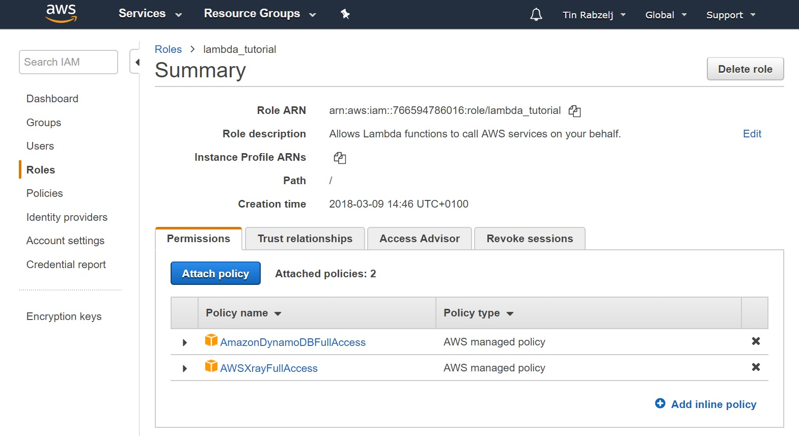

This article shows how to build a URL shortener in Go and deploy it to AWS Lambda. If you're only interested in the source code, you can find it on [GitHub](https://github.com/tinrab/url-shortener-lambda).

# Getting started

To begin, install [Go](https://golang.org/doc/install), if you haven't already. Then [Install](https://docs.aws.amazon.com/cli/latest/userguide/installing.html) and [configure](https://docs.aws.amazon.com/cli/latest/userguide/cli-chap-getting-started.html) AWS CLI tool.

Create a directory for your project inside `$GOPATH`. All of the following paths will be relative to this directory.

The AWS region is assumed to be `us-east-1`.

# DynamoDB table

Create `urlshortenerlinks_table.json` file, which describes the table.

```json
{
  "TableName": "UrlShortenerLinks",
  "AttributeDefinitions": [{
    "AttributeName": "short_url",
    "AttributeType": "S"
  }],
  "KeySchema": [{
    "KeyType": "HASH",
    "AttributeName": "short_url"
  }],
  "ProvisionedThroughput": {
    "WriteCapacityUnits": 5,
    "ReadCapacityUnits": 5
  }
}
```

Run the following command to create the table on AWS.

```
$ aws dynamodb create-table --region us-east-1 --cli-input-json file://urlshortenerlinks_table.json
```

# Shorten function

Create `main.go` file inside `shorten` directory.

```go
package main

const (
  LinksTableName = "UrlShortenerLinks"
  Region         = "us-east-1"
)
```

Declare request and response structs.

```go
type Request struct {
  URL string `json:"url"`
}

type Response struct {
  ShortURL string `json:"short_url"`
}
```

Declare a struct to describe the DynamoDB table item. `ShortURL` will be used as primary key.

```go
type Link struct {
  ShortURL string `json:"short_url"`
  LongURL  string `json:"long_url"`
}
```

Declare Lambda handler function and hook it up in the `main` function.

```go
func Handler(request events.APIGatewayProxyRequest) (events.APIGatewayProxyResponse, error) {
  // ...
}

func main() {
  lambda.Start(Handler)
}
```

Inside `Handler` function parse the request body.

```go
rb := Request{}
if err := json.Unmarshal([]byte(request.Body), &rb); err != nil {
  return events.APIGatewayProxyResponse{}, err
}
```

Start a DynamoDB session.

```go
sess, err := session.NewSession(&aws.Config{
  Region: aws.String(Region),
})
if err != nil {
  return events.APIGatewayProxyResponse{}, err
}
svc := dynamodb.New(sess)
```

Generate a short URL using [teris-io/shortid](github.com/teris-io/shortid) package. It's called a "URL" even though it's just an ID. The full URL will depend on the hostname.

```go
shortURL := shortid.MustGenerate()
// Because "shorten" endpoint is reserved
for shortURL == "shorten" {
  shortURL = shortid.MustGenerate()
}
link := &Link{
  ShortURL: shortURL,
  LongURL:  rb.URL,
}
```

Marshal the link into a attribute value map.

```go
av, err := dynamodbattribute.MarshalMap(link)
if err != nil {
  return events.APIGatewayProxyResponse{}, err
}
```

Insert link into DynamoDB table.

```go
input := &dynamodb.PutItemInput{
  Item:      av,
  TableName: aws.String(LinksTableName),
}
if _, err = svc.PutItem(input); err != nil {
  return events.APIGatewayProxyResponse{}, err
}
```

Return short URL in the response body.

```go
response, err := json.Marshal(Response{ShortURL: shortURL})
if err != nil {
  return events.APIGatewayProxyResponse{}, err
}
return events.APIGatewayProxyResponse{
  StatusCode: http.StatusOK,
  Body:       string(response),
}, nil
```

# Redirect function

Create another `main.go` file, this time inside `redirect` directory.

```go
package main

const (
  LinksTableName = "UrlShortenerLinks"
  Region         = "us-east-1"
)

type Link struct {
  ShortURL string `json:"short_url"`
  LongURL  string `json:"long_url"`
}
```

Declare `Handler` function.

```go
func Handler(request events.APIGatewayProxyRequest) (events.APIGatewayProxyResponse, error) {
  // ...
}

func main() {
  lambda.Start(Handler)
}
```

Get `short_url` parameter inside `Handler` function.

```go
shortURL, ok := request.PathParameters["short_url"]
```

Start DynamoDB session.

```go
sess, err := session.NewSession(&aws.Config{
  Region: aws.String(Region),
})
if err != nil {
  return events.APIGatewayProxyResponse{}, err
}
svc := dynamodb.New(sess)
```

Read link item from DynamoDB table.

```go
result, err := svc.GetItem(&dynamodb.GetItemInput{
  TableName: aws.String(LinksTableName),
  Key: map[string]*dynamodb.AttributeValue{
    "short_url": {
      S: aws.String(shortURL),
    },
  },
})
if err != nil {
  return events.APIGatewayProxyResponse{}, err
}
```

Parse link item into the `Link` struct.

```go
link := Link{}
if err := dynamodbattribute.UnmarshalMap(result.Item, &link); err != nil {
  return events.APIGatewayProxyResponse{}, err
}
```

Redirect user to the long URL by specifying the `location` header.

```go
return events.APIGatewayProxyResponse{
  StatusCode: http.StatusPermanentRedirect,
  Headers: map[string]string{
    "location": link.LongURL,
  },
}, nil
```

# Deploy

You need to create a IAM role. Go to AWS [IAM Management Console](https://console.aws.amazon.com/iam/home), under **Roles** click on **Create role**. Then add `AmazonDynamoDBFullAccess` and `AWSXrayFullAccess` policies.



Note the **Role ARN** value.

Build both Go apps on Linux and macOS with the following commands.

```
$ GOOS=linux GOARCH=amd64 go build -o shorten main.go
$ zip deployment.zip shorten
```

And if you're on Windows, you'll need to use `build-lambda-zip` tool.

```
$ go get -u github.com/aws/aws-lambda-go/cmd/build-lambda-zip
$ set GOOS=linux
$ set GOARCH=amd64
$ go build -o shorten main.go
$ build-lambda-zip -o deployment.zip shorten
```

Replace `$ROLE` with your Role ARN, and deploy both functions.

```
$ aws lambda create-function --region us-east-1 --function-name ShortenFunction --zip-file fileb://./deployment.zip --runtime go1.x --tracing-config Mode=Active --role $ROLE --handler shorten
```

If the function already exist, use `update-function-code` command instead.

```
$ aws lambda update-function-code --function-name ShortenFunction --region us-east-1 --zip-file fileb://./deployment.zip
```

Similarly, deploy the redirect function by changing the name from `ShortenFunction` to `RedirectFunction` and executable file from `shorten` to `redirect`.

## Set up API Gateway

Go to [API Gateway](https://console.aws.amazon.com/apigateway/home?region=us-east-1#/apis) console. Under **APIs** click on **Create API**, choose a name, and create your API.

Under **YourAPI/Resources** click **Actions/Create Resource**. Enter "Shorten" as a name and "/shorten" as path. Check **Enable API Gateway CORS**.

Create a **POST** method for "/shorten" resource with **Actions/Create Method**. Select "Lambda Function" for **Integration type**, check **Use Lambda Proxy integration**, select "us-east-1" as **Lambda Region**, select your "ShortenFunction" Lambda function under **Lambda Function**, then click **Save**.

Create another resource called "Redirect". Enable **Configure as proxy resource** and enter "{short_url+}" under **Resource path**. Create a **ANY** method, select **Lambda Function proxy** under **Integration type**, and select your "RedirectFunction" Lambda function.

To make your URL shortener API public, click **Actions/Deploy API**. Select "[New Stage]" under **Deployment stage**, enter "prod" for **Stage name**, and click **Create**. The API should now be available on **Invoke URL**, which can be found at **YourAPI/Stages/prod**.

# Wrapping up

Test your URL shortener API.

```
$ curl $INVOKE_URL/shorten -X POST -d '{"url":"https://outcrawl.com/getting-started-microservices-go-grpc-kubernetes/"}'
{"short_url":"SHORT_URL"}
```

Then navigate to `INVOKE_URL/SHORT_URL` with your browser.

Entire source code is available on [GitHub](https://github.com/tinrab/url-shortener-lambda).
