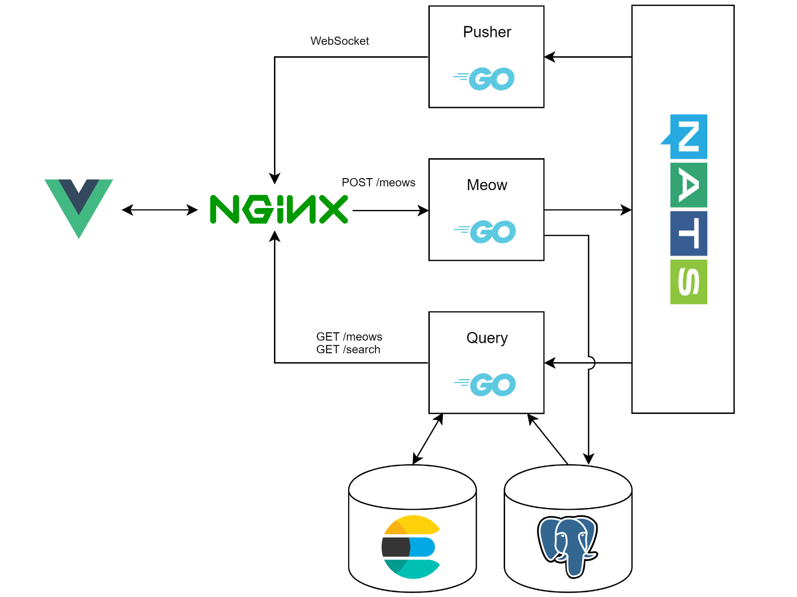
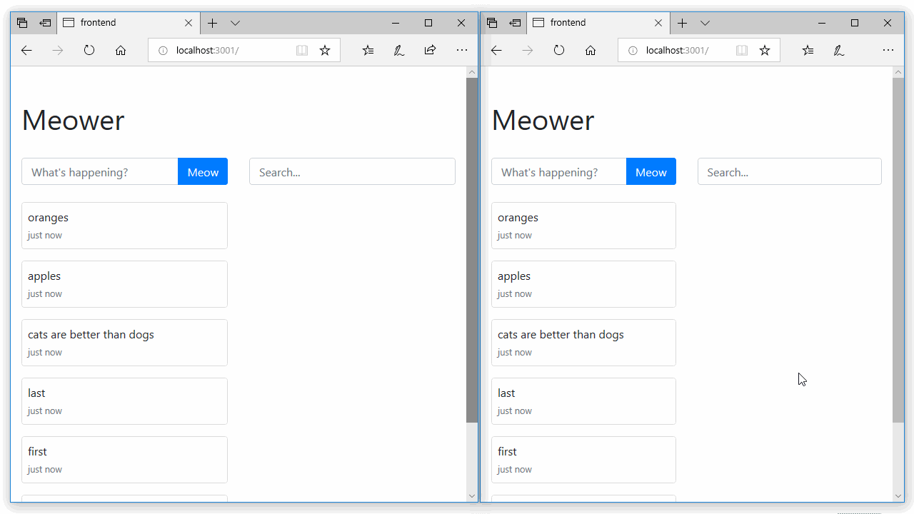

This article walks through the development of a simplistic social network application where anyone can post anonymous messages.

Source code is available on [GitHub](https://github.com/tinrab/meower).

# Architecture

The application is built using the Command Query Responsibility Segregation ([CQRS](https://martinfowler.com/bliki/CQRS.html)) pattern. The goal is to decouple command and query sides into separate services, where commands perform writing into the database and queries read eventually persistent data. The separation enables scaling the two sides independently, which is an advantage because normally there are more read operations than write operations. It also means we can have different data models for each service. The query side might return data in [materialized views](https://docs.microsoft.com/en-us/azure/architecture/patterns/materialized-view), which are created independently and asynchronously of the command side.

The application this article describes, is called Meower: a social network for cats.



There are three services&mdash;Pusher, Meow and Query. Meow service handles the command side by exposing one HTTP POST endpoint for creating meows. Query service listens to events and inserts meows into Elasticsearch database. It exposes endpoints for reading meows ordered by time and performing full-text search. Pusher service sends newly created meows to clients through WebSockets.

Note that Meow and Query services are not strongly bounded, since they're using the same database. This goes against the whole idea, but it will make things a bit simpler. This is a development-only setup (there is no SSL, no replicas, all storage is ephemeral, etc.).

# Prerequisites

If you haven't already, install [Docker](https://docs.docker.com/install/), [Go](https://golang.org/doc/install) and [golang/dep](https://github.com/golang/dep) dependency management tool.

Create a directory for your project inside `$GOPATH`.

> The project's root directory is assumed to be `github.com/tinrab/meower` throughout this article. Every time a package is added to the Go source file, make sure dependencies are up to date by running `dep ensure`.

# Utilities

Starting off, create some utilities and a facade for communicating with third-party services.

Create `util` subdirectory and `util/util.go` file.

```go
package util

import (
  "encoding/json"
  "net/http"
)

func ResponseOk(w http.ResponseWriter, body interface{}) {
  w.WriteHeader(http.StatusOK)
  w.Header().Set("Content-Type", "application/json")

  json.NewEncoder(w).Encode(body)
}

func ResponseError(w http.ResponseWriter, code int, message string) {
  w.WriteHeader(code)
  w.Header().Set("Content-Type", "application/json")

  body := map[string]string{
    "error": message,
  }
  json.NewEncoder(w).Encode(body)
}
```

## PostgreSQL

Create `schema` subdirectory and `schema/model.go` file.

```go
package schema

import (
  "time"
)

type Meow struct {
  ID        string    `json:"id"`
  Body      string    `json:"body"`
  CreatedAt time.Time `json:"created_at"`
}
```

Create `db` subdirectory and `db/repository.go` file.

```go
package db

import (
  "context"

  "github.com/tinrab/meower/schema"
)

type Repository interface {
  Close()
  InsertMeow(ctx context.Context, meow schema.Meow) error
  ListMeows(ctx context.Context, skip uint64, take uint64) ([]schema.Meow, error)
}

var impl Repository

func SetRepository(repository Repository) {
  impl = repository
}

func Close() {
  impl.Close()
}

func InsertMeow(ctx context.Context, meow schema.Meow) error {
  return impl.InsertMeow(ctx, meow)
}

func ListMeows(ctx context.Context, skip uint64, take uint64) ([]schema.Meow, error) {
  return impl.ListMeows(ctx, skip, take)
}
```

This is a straightforward way of achieving [inversion of control](https://www.martinfowler.com/articles/injection.html). By using `Repository` interface you allow any concrete implementation to be injected at runtime, and all function calls will be delegated to the `impl` object.

You can implement an in-memory database, which conforms to `Repository` interface, and use it during development and testing.

Create `docker-compose.yaml` file in your project's root directory and declare the `postgres` service in it.

```yaml
version: "3.6"

services:
# highlight-start
  postgres:
    build: "./postgres"
    restart: "always"
    environment:
      POSTGRES_DB: "meower"
      POSTGRES_USER: "meower"
      POSTGRES_PASSWORD: "123456"
# highlight-end
```

Create `postgres` subdirectory and a `postgres/up.sql` file, which contains table definitions.

```sql
DROP TABLE IF EXISTS meows;
CREATE TABLE meows (
  id VARCHAR(32) PRIMARY KEY,
  body TEXT NOT NULL,
  created_at TIMESTAMP WITH TIME ZONE NOT NULL
);
```

Create a `postgres/Dockerfile` file and copy `postgres/up.sql` file into the container as `1.sql`.

```docker
FROM postgres:10.3
COPY up.sql /docker-entrypoint-initdb.d/1.sql
CMD ["postgres"]
```

SQL files inside `/docker-entrypoint-initdb.d` directory will be executed in alphabetical order.

Implement `Repository` interface for PostgreSQL database inside `db/postgres.go` file by using [lib/pq](https://github.com/lib/pq) package.

```go
package db

import (
  "context"
  "database/sql"

  _ "github.com/lib/pq"
  "github.com/tinrab/meower/schema"
)

type PostgresRepository struct {
  db *sql.DB
}

func NewPostgres(url string) (*PostgresRepository, error) {
  db, err := sql.Open("postgres", url)
  if err != nil {
    return nil, err
  }
  return &PostgresRepository{
    db,
  }, nil
}

func (r *PostgresRepository) Close() {
  r.db.Close()
}

func (r *PostgresRepository) InsertMeow(ctx context.Context, meow schema.Meow) error {
  _, err := r.db.Exec("INSERT INTO meows(id, body, created_at) VALUES($1, $2, $3)", meow.ID, meow.Body, meow.CreatedAt)
  return err
}

func (r *PostgresRepository) ListMeows(ctx context.Context, skip uint64, take uint64) ([]schema.Meow, error) {
  rows, err := r.db.Query("SELECT * FROM meows ORDER BY id DESC OFFSET $1 LIMIT $2", skip, take)
  if err != nil {
    return nil, err
  }
  defer rows.Close()

  // Parse all rows into an array of Meows
  meows := []schema.Meow{}
  for rows.Next() {
    meow := schema.Meow{}
    if err = rows.Scan(&meow.ID, &meow.Body, &meow.CreatedAt); err == nil {
      meows = append(meows, meow)
    }
  }
  if err = rows.Err(); err != nil {
    return nil, err
  }

  return meows, nil
}
```

Meows are being ordered by their primary key, because keys will be k-sortable by time. This is to avoid introducing an additional index ([more info](/generating-unique-ids-kubernetes)).

## NATS

Add `nats` service to `docker-compose.yaml`.

```yaml
services:
# highlight-start
  nats:
    image: "nats-streaming:0.9.2"
    restart: "always"
# highlight-end
```

Create `event` subdirectory and `event/messages.go` file, which contains event message types.

```go
package event

import (
  "time"
)

type Message interface {
  Key() string
}

type MeowCreatedMessage struct {
  ID        string
  Body      string
  CreatedAt time.Time
}

func (m *MeowCreatedMessage) Key() string {
  return "meow.created"
}
```

Similarly as with database access pattern, declare utility functions for dealing with the event store inside `event/event.go` file.

```go
package event

import "github.com/tinrab/meower/schema"

type EventStore interface {
  Close()
  PublishMeowCreated(meow schema.Meow) error
  SubscribeMeowCreated() (<-chan MeowCreatedMessage, error)
  OnMeowCreated(f func(MeowCreatedMessage)) error
}

var impl EventStore

func SetEventStore(es EventStore) {
  impl = es
}

func Close() {
  impl.Close()
}

func PublishMeowCreated(meow schema.Meow) error {
  return impl.PublishMeowCreated(meow)
}

func SubscribeMeowCreated() (<-chan MeowCreatedMessage, error) {
  return impl.SubscribeMeowCreated()
}

func OnMeowCreated(f func(MeowCreatedMessage)) error {
  return impl.OnMeowCreated(f)
}
```

Now implement `EventStore` interface for NATS in `event/nats.go` file.

```go
package event

import (
  "bytes"
  "encoding/gob"

  "github.com/nats-io/go-nats"
  "github.com/tinrab/meower/schema"
)

type NatsEventStore struct {
  nc                      *nats.Conn
  meowCreatedSubscription *nats.Subscription
  meowCreatedChan         chan MeowCreatedMessage
}

func NewNats(url string) (*NatsEventStore, error) {
  nc, err := nats.Connect(url)
  if err != nil {
    return nil, err
  }
  return &NatsEventStore{nc: nc}, nil
}

func (e *NatsEventStore) Close() {
  if e.nc != nil {
    e.nc.Close()
  }
  if e.meowCreatedSubscription != nil {
    e.meowCreatedSubscription.Unsubscribe()
  }
  close(e.meowCreatedChan)
}

func (e *NatsEventStore) PublishMeowCreated(meow schema.Meow) error {
  m := MeowCreatedMessage{meow.ID, meow.Body, meow.CreatedAt}
  data, err := e.writeMessage(&m)
  if err != nil {
    return err
  }
  return e.nc.Publish(m.Key(), data)
}

func (mq *NatsEventStore) writeMessage(m Message) ([]byte, error) {
  b := bytes.Buffer{}
  err := gob.NewEncoder(&b).Encode(m)
  if err != nil {
    return nil, err
  }
  return b.Bytes(), nil
}
```

Here are two different approaches of implementing the subscription functions. When consuming this API, use whichever one you prefer.

One way is to use a callback function.

```go
func (e *NatsEventStore) OnMeowCreated(f func(MeowCreatedMessage)) (err error) {
  m := MeowCreatedMessage{}
  e.meowCreatedSubscription, err = e.nc.Subscribe(m.Key(), func(msg *nats.Msg) {
    e.readMessage(msg.Data, &m)
    f(m)
  })
  return
}

func (mq *NatsEventStore) readMessage(data []byte, m interface{}) error {
  b := bytes.Buffer{}
  b.Write(data)
  return gob.NewDecoder(&b).Decode(m)
}
```

Another way is to return a channel. Here, an intermediate channel is created to transform messages into appropriate type.

```go
func (e *NatsEventStore) SubscribeMeowCreated() (<-chan MeowCreatedMessage, error) {
  m := MeowCreatedMessage{}
  e.meowCreatedChan = make(chan MeowCreatedMessage, 64)
  ch := make(chan *nats.Msg, 64)
  var err error
  e.meowCreatedSubscription, err = e.nc.ChanSubscribe(m.Key(), ch)
  if err != nil {
    return nil, err
  }
  // Decode message
  go func() {
    for {
      select {
      case msg := <-ch:
        e.readMessage(msg.Data, &m)
        e.meowCreatedChan <- m
      }
    }
  }()
  return (<-chan MeowCreatedMessage)(e.meowCreatedChan), nil
}
```

## Elasticsearch

Update `docker-compose.yaml` file.

```yaml
services:
# highlight-start
  elasticsearch:
  image: 'docker.elastic.co/elasticsearch/elasticsearch:6.2.3'
# highlight-end
```

Create a repository interface inside `search/repository.go` file.

```go
package search

import (
  "context"

  "github.com/tinrab/meower/schema"
)

type Repository interface {
  Close()
  InsertMeow(ctx context.Context, meow schema.Meow) error
  SearchMeows(ctx context.Context, query string, skip uint64, take uint64) ([]schema.Meow, error)
}

var impl Repository

func SetRepository(repository Repository) {
  impl = repository
}

func Close() {
  impl.Close()
}

func InsertMeow(ctx context.Context, meow schema.Meow) error {
  return impl.InsertMeow(ctx, meow)
}

func SearchMeows(ctx context.Context, query string, skip uint64, take uint64) ([]schema.Meow, error) {
  return impl.SearchMeows(ctx, query, skip, take)
}
```

Implement the interface for Elasticsearch inside `search/elastic.go` by using [olivere/elastic](https://github.com/olivere/elastic) package.

```go
package search

import (
  "context"
  "encoding/json"
  "log"

  "github.com/olivere/elastic"
  "github.com/tinrab/meower/schema"
)

type ElasticRepository struct {
  client *elastic.Client
}

func NewElastic(url string) (*ElasticRepository, error) {
  client, err := elastic.NewClient(
    elastic.SetURL(url),
    elastic.SetSniff(false),
  )
  if err != nil {
    return nil, err
  }
  return &ElasticRepository{client}, nil
}

func (r *ElasticRepository) Close() {
}

func (r *ElasticRepository) InsertMeow(ctx context.Context, meow schema.Meow) error {
  _, err := r.client.Index().
    Index("meows").
    Type("meow").
    Id(meow.ID).
    BodyJson(meow).
    Refresh("wait_for").
    Do(ctx)
  return err
}

func (r *ElasticRepository) SearchMeows(ctx context.Context, query string, skip uint64, take uint64) ([]schema.Meow, error) {
  result, err := r.client.Search().
    Index("meows").
    Query(
      elastic.NewMultiMatchQuery(query, "body").
        Fuzziness("3").
        PrefixLength(1).
        CutoffFrequency(0.0001),
    ).
    From(int(skip)).
    Size(int(take)).
    Do(ctx)
  if err != nil {
    return nil, err
  }
  meows := []schema.Meow{}
  for _, hit := range result.Hits.Hits {
    var meow schema.Meow
    if err = json.Unmarshal(*hit.Source, &meow); err != nil {
      log.Println(err)
    }
    meows = append(meows, meow)
  }
  return meows, nil
}
```

# Meow service

Create a `meow-service` subdirectory, and in `meow-services/main.go` file parse configuration from environment variables.

```go
package main

import (
  "fmt"
  "log"
  "net/http"
  "time"

  "github.com/gorilla/handlers"
  "github.com/gorilla/mux"
  "github.com/kelseyhightower/envconfig"
  "github.com/tinrab/meower/db"
  "github.com/tinrab/meower/event"
  "github.com/tinrab/retry"
)

type Config struct {
  PostgresDB       string `envconfig:"POSTGRES_DB"`
  PostgresUser     string `envconfig:"POSTGRES_USER"`
  PostgresPassword string `envconfig:"POSTGRES_PASSWORD"`
  NatsAddress      string `envconfig:"NATS_ADDRESS"`
}

func main() {
  var cfg Config
  err := envconfig.Process("", &cfg)
  if err != nil {
    log.Fatal(err)
  }
  // ...
}
```

Connect to PostgreSQL and inject the repository. The code below retries connection every 2 seconds with [tinrab/retry](https://github.com/tinrab/retry) package.

```go
retry.ForeverSleep(2*time.Second, func(attempt int) error {
  addr := fmt.Sprintf("postgres://%s:%s@postgres/%s?sslmode=disable", cfg.PostgresUser, cfg.PostgresPassword, cfg.PostgresDB)
  repo, err := db.NewPostgres(addr)
  if err != nil {
    log.Println(err)
    return err
  }
  db.SetRepository(repo)
  return nil
})
defer db.Close()
```

Connect to NATS.

```go
retry.ForeverSleep(2*time.Second, func(_ int) error {
  es, err := event.NewNats(fmt.Sprintf("nats://%s", cfg.NatsAddress))
  if err != nil {
    log.Println(err)
    return err
  }
  event.SetEventStore(es)
  return nil
})
defer event.Close()
```

Finally, run the HTTP server.

```go
func newRouter() (router *mux.Router) {
  router = mux.NewRouter()
  router.HandleFunc("/meows", createMeowHandler).
    Methods("POST").
    Queries("body", "{body}")
  return
}

func main() {
  // ...
  router := newRouter()
  if err := http.ListenAndServe(":8080", router); err != nil {
    log.Fatal(err)
  }
}
```

The router binds `POST /meows` endpoint to the `createMeowHandler` handler function. Declare it inside `meow-service/handlers.go` file.

```go
package main

import (
  "html/template"
  "log"
  "net/http"
  "time"

  "github.com/segmentio/ksuid"
  "github.com/tinrab/meower/db"
  "github.com/tinrab/meower/event"
  "github.com/tinrab/meower/schema"
  "github.com/tinrab/meower/util"
)

func createMeowHandler(w http.ResponseWriter, r *http.Request) {
  type response struct {
    ID string `json:"id"`
  }

  ctx := r.Context()

  // Read parameters
  body := template.HTMLEscapeString(r.FormValue("body"))
  if len(body) < 1 || len(body) > 140 {
    util.ResponseError(w, http.StatusBadRequest, "Invalid body")
    return
  }

  // Create meow
  createdAt := time.Now().UTC()
  id, err := ksuid.NewRandomWithTime(createdAt)
  if err != nil {
    util.ResponseError(w, http.StatusInternalServerError, "Failed to create meow")
    return
  }
  meow := schema.Meow{
    ID:        id.String(),
    Body:      body,
    CreatedAt: createdAt,
  }
  if err := db.InsertMeow(ctx, meow); err != nil {
    log.Println(err)
    util.ResponseError(w, http.StatusInternalServerError, "Failed to create meow")
    return
  }

  // Publish event
  if err := event.PublishMeowCreated(meow); err != nil {
    log.Println(err)
  }

  // Return new meow
  util.ResponseOk(w, response{ID: meow.ID})
}
```

A new meow is created, inserted into the database, and an event is published.

# Query service

Create `query-service` subdirectory and read the configuration variables inside `query-service/main.go` file.

```go
package main

import (
  "fmt"
  "log"
  "net/http"
  "time"

  "github.com/gorilla/mux"
  "github.com/kelseyhightower/envconfig"
  "github.com/tinrab/meower/db"
  "github.com/tinrab/meower/event"
  "github.com/tinrab/meower/search"
  "github.com/tinrab/retry"
)

type Config struct {
  PostgresDB           string `envconfig:"POSTGRES_DB"`
  PostgresUser         string `envconfig:"POSTGRES_USER"`
  PostgresPassword     string `envconfig:"POSTGRES_PASSWORD"`
  NatsAddress          string `envconfig:"NATS_ADDRESS"`
  ElasticsearchAddress string `envconfig:"ELASTICSEARCH_ADDRESS"`
}

func main() {
  var cfg Config
  err := envconfig.Process("", &cfg)
  if err != nil {
    log.Fatal(err)
  }
  // ...
}
```

Then connect to PostgreSQL, Elasticsearch and NATS.

```go
// Connect to PostgreSQL
retry.ForeverSleep(2*time.Second, func(attempt int) error {
  addr := fmt.Sprintf("postgres://%s:%s@postgres/%s?sslmode=disable", cfg.PostgresUser, cfg.PostgresPassword, cfg.PostgresDB)
  repo, err := db.NewPostgres(addr)
  if err != nil {
    log.Println(err)
    return err
  }
  db.SetRepository(repo)
  return nil
})
defer db.Close()

// Connect to ElasticSearch
retry.ForeverSleep(2*time.Second, func(_ int) error {
  es, err := search.NewElastic(fmt.Sprintf("http://%s", cfg.ElasticsearchAddress))
  if err != nil {
    log.Println(err)
    return err
  }
  search.SetRepository(es)
  return nil
})
defer search.Close()

// Connect to Nats
retry.ForeverSleep(2*time.Second, func(_ int) error {
  es, err := event.NewNats(fmt.Sprintf("nats://%s", cfg.NatsAddress))
  if err != nil {
    log.Println(err)
    return err
  }
  err = es.OnMeowCreated(onMeowCreated)
  if err != nil {
    log.Println(err)
    return err
  }
  event.SetEventStore(es)
  return nil
})
defer event.Close()
```

Here, the query service is subscribed to `OnMeowCreated` event using `onMeowCreated` function.

Start the HTTP server.

```go
func newRouter() (router *mux.Router) {
  router = mux.NewRouter()
  router.HandleFunc("/meows", listMeowsHandler).
    Methods("GET")
  router.HandleFunc("/search", searchMeowsHandler).
    Methods("GET")
  return
}

func main() {
  // ...
  router := newRouter()
  if err := http.ListenAndServe(":8080", router); err != nil {
    log.Fatal(err)
  }
}
```

Then in `query-service/handlers.go`, first declare `onMeowCreated` function to insert a meow into Elasticsearch whenever the `OnMeowCreated` event is received.

```go
package main

import (
  "context"
  "log"
  "net/http"
  "strconv"

  "github.com/tinrab/meower/db"
  "github.com/tinrab/meower/event"
  "github.com/tinrab/meower/schema"
  "github.com/tinrab/meower/search"
  "github.com/tinrab/meower/util"
)

func onMeowCreated(m event.MeowCreatedMessage) {
  meow := schema.Meow{
    ID:        m.ID,
    Body:      m.Body,
    CreatedAt: m.CreatedAt,
  }
  if err := search.InsertMeow(context.Background(), meow); err != nil {
    log.Println(err)
  }
}
```

Write the `searchMeowsHandler` handler function, which performs full-text search and returns meows bounded with `skip` and `take` parameters.

```go
func searchMeowsHandler(w http.ResponseWriter, r *http.Request) {
  var err error
  ctx := r.Context()

  // Read parameters
  query := r.FormValue("query")
  if len(query) == 0 {
    util.ResponseError(w, http.StatusBadRequest, "Missing query parameter")
    return
  }
  skip := uint64(0)
  skipStr := r.FormValue("skip")
  take := uint64(100)
  takeStr := r.FormValue("take")
  if len(skipStr) != 0 {
    skip, err = strconv.ParseUint(skipStr, 10, 64)
    if err != nil {
      util.ResponseError(w, http.StatusBadRequest, "Invalid skip parameter")
      return
    }
  }
  if len(takeStr) != 0 {
    take, err = strconv.ParseUint(takeStr, 10, 64)
    if err != nil {
      util.ResponseError(w, http.StatusBadRequest, "Invalid take parameter")
      return
    }
  }

  // Search meows
  meows, err := search.SearchMeows(ctx, query, skip, take)
  if err != nil {
    log.Println(err)
    util.ResponseOk(w, []schema.Meow{})
    return
  }

  util.ResponseOk(w, meows)
}
```

Write the `listMeowsHandler` which returns all meows ordered by creation time.

```go
func listMeowsHandler(w http.ResponseWriter, r *http.Request) {
  ctx := r.Context()
  var err error

  // Read parameters
  skip := uint64(0)
  skipStr := r.FormValue("skip")
  take := uint64(100)
  takeStr := r.FormValue("take")
  if len(skipStr) != 0 {
    skip, err = strconv.ParseUint(skipStr, 10, 64)
    if err != nil {
      util.ResponseError(w, http.StatusBadRequest, "Invalid skip parameter")
      return
    }
  }
  if len(takeStr) != 0 {
    take, err = strconv.ParseUint(takeStr, 10, 64)
    if err != nil {
      util.ResponseError(w, http.StatusBadRequest, "Invalid take parameter")
      return
    }
  }

  // Fetch meows
  meows, err := db.ListMeows(ctx, skip, take)
  if err != nil {
    log.Println(err)
    util.ResponseError(w, http.StatusInternalServerError, "Could not fetch meows")
    return
  }

  util.ResponseOk(w, meows)
}
```

# Pusher service

Create `pusher-service` subdirectory.

## Messages

Create `pusher-service/messages.go` file and declare messages to be send through WebSockets.

```go
package main

import (
  "time"
)

const (
  KindMeowCreated = iota + 1
)

type MeowCreatedMessage struct {
  Kind      uint32    `json:"kind"`
  ID        string    `json:"id"`
  Body      string    `json:"body"`
  CreatedAt time.Time `json:"created_at"`
}

func newMeowCreatedMessage(id string, body string, createdAt time.Time) *MeowCreatedMessage {
  return &MeowCreatedMessage{
    Kind:      KindMeowCreated,
    ID:        id,
    Body:      body,
    CreatedAt: createdAt,
  }
}
```

## Client

Create `pusher-service/client.go` file and declare a struct representing a connected client.

```go
package main

import "github.com/gorilla/websocket"

type Client struct {
  hub      *Hub
  id       int
  socket   *websocket.Conn
  outbound chan []byte
}

func newClient(hub *Hub, socket *websocket.Conn) *Client {
  return &Client{
    hub:      hub,
    socket:   socket,
    outbound: make(chan []byte),
  }
}

func (client *Client) write() {
  for {
    select {
    case data, ok := <-client.outbound:
      if !ok {
        client.socket.WriteMessage(websocket.CloseMessage, []byte{})
        return
      }
      client.socket.WriteMessage(websocket.TextMessage, data)
    }
  }
}

func (client Client) close() {
  client.socket.Close()
  close(client.outbound)
}
```

## Hub

Create `pusher-service/hub.go` file for the `Hub` struct which manages all clients.

```go
package main

import (
  "encoding/json"
  "log"
  "net/http"
  "sync"

  "github.com/gorilla/websocket"
)

var upgrader = websocket.Upgrader{
  CheckOrigin: func(r *http.Request) bool { return true },
}

type Hub struct {
  clients    []*Client
  nextID     int
  register   chan *Client
  unregister chan *Client
  mutex      *sync.Mutex
}

func newHub() *Hub {
  return &Hub{
    clients:    make([]*Client, 0),
    nextID:     0,
    register:   make(chan *Client),
    unregister: make(chan *Client),
    mutex:      &sync.Mutex{},
  }
}
```

Write the `Run` function.

```go
func (hub *Hub) run() {
  for {
    select {
    case client := <-hub.register:
      hub.onConnect(client)
    case client := <-hub.unregister:
      hub.onDisconnect(client)
    }
  }
}
```

Write functions for sending messages.

```go
func (hub *Hub) broadcast(message interface{}, ignore *Client) {
  data, _ := json.Marshal(message)
  for _, c := range hub.clients {
    if c != ignore {
      c.outbound <- data
    }
  }
}

func (hub *Hub) send(message interface{}, client *Client) {
  data, _ := json.Marshal(message)
  client.outbound <- data
}
```

Write a function for upgrading HTTP requests to a WebSocket connection.

```go
func (hub *Hub) handleWebSocket(w http.ResponseWriter, r *http.Request) {
  socket, err := upgrader.Upgrade(w, r, nil)
  if err != nil {
    log.Println(err)
    http.Error(w, "could not upgrade", http.StatusInternalServerError)
    return
  }
  client := newClient(hub, socket)
  hub.register <- client

  go client.write()
}
```

When a client gets connected, add it to the list.

```go
func (hub *Hub) onConnect(client *Client) {
  log.Println("client connected: ", client.socket.RemoteAddr())

  // Make new client
  hub.mutex.Lock()
  defer hub.mutex.Unlock()
  client.id = hub.nextID
  hub.nextID++
  hub.clients = append(hub.clients, client)
}
```

When a client disconnects, remove it from the list.

```go
func (hub *Hub) onDisconnect(client *Client) {
  log.Println("client disconnected: ", client.socket.RemoteAddr())

  client.close()
  hub.mutex.Lock()
  defer hub.mutex.Unlock()

  // Find index of client
  i := -1
  for j, c := range hub.clients {
    if c.id == client.id {
      i = j
      break
    }
  }
  // Delete client from list
  copy(hub.clients[i:], hub.clients[i+1:])
  hub.clients[len(hub.clients)-1] = nil
  hub.clients = hub.clients[:len(hub.clients)-1]
}

```

## Entry point

Create `pusher-service/main.go` file.

```go
package main

import (
  "fmt"
  "log"
  "net/http"
  "time"

  "github.com/kelseyhightower/envconfig"
  "github.com/tinrab/meower/event"
  "github.com/tinrab/retry"
)

type Config struct {
  NatsAddress string `envconfig:"NATS_ADDRESS"`
}

func main() {
  var cfg Config
  err := envconfig.Process("", &cfg)
  if err != nil {
    log.Fatal(err)
  }

  // Connect to Nats
  hub := newHub()
  retry.ForeverSleep(2*time.Second, func(_ int) error {
    es, err := event.NewNats(fmt.Sprintf("nats://%s", cfg.NatsAddress))
    if err != nil {
      log.Println(err)
      return err
    }

    // Push messages to clients
    err = es.OnMeowCreated(func(m event.MeowCreatedMessage) {
      log.Printf("Meow received: %v\n", m)
      hub.broadcast(newMeowCreatedMessage(m.ID, m.Body, m.CreatedAt), nil)
    })
    if err != nil {
      log.Println(err)
      return err
    }

    event.SetEventStore(es)
    return nil
  })
  defer event.Close()

  // Run WebSocket server
  go hub.run()
  http.HandleFunc("/pusher", hub.handleWebSocket)
  err = http.ListenAndServe(":8080", nil)
  if err != nil {
    log.Fatal(err)
  }
}
```

# Docker image

Specify all services and dependencies between them in `docker-compose.yaml` file.

```yaml
services:
  meow:
    build: "."
    command: "meow-service"
    depends_on:
      - "postgres"
      - "nats"
    ports:
      - "8080"
    environment:
      POSTGRES_DB: "meower"
      POSTGRES_USER: "meower"
      POSTGRES_PASSWORD: "123456"
      NATS_ADDRESS: "nats:4222"
  query:
    build: "."
    command: "query-service"
    depends_on:
      - "postgres"
      - "nats"
    ports:
      - "8080"
    environment:
      POSTGRES_DB: "meower"
      POSTGRES_USER: "meower"
      POSTGRES_PASSWORD: "123456"
      NATS_ADDRESS: "nats:4222"
      ELASTICSEARCH_ADDRESS: "elasticsearch:9200"
  pusher:
    build: "."
    command: "pusher-service"
    depends_on:
      - "nats"
    ports:
      - "8080"
    environment:
      NATS_ADDRESS: "nats:4222"
```

Create a `Dockerfile` file inside project's root directory. This image is built in two stages and contains binaries for all services. See [Multi-Stage Docker Builds for Kubernetes](/multi-stage-docker-builds-kubernetes) for more information.

```docker
FROM golang:1.10.2-alpine3.7 AS build
RUN apk --no-cache add gcc g++ make ca-certificates
WORKDIR /go/src/github.com/tinrab/meower

COPY Gopkg.lock Gopkg.toml ./
COPY vendor vendor
COPY util util
COPY event event
COPY db db
COPY search search
COPY schema schema
COPY meow-service meow-service
COPY query-service query-service
COPY pusher-service pusher-service

RUN go install ./...

FROM alpine:3.7
WORKDIR /usr/bin
COPY --from=build /go/bin .
```

# Reverse proxy

Reverse proxy will route traffic from and to the front-end app.

Update `docker-compose.yaml` file.

```yaml
services:
# highlight-start
  nginx:
    build: "./nginx"
    ports:
      - "8080:80"
    depends_on:
      - "meow"
      - "query"
      - "pusher"
# highlight-end
```

Create `nginx` subdirectory and `nginx/Dockerfile` file.

```docker
FROM nginx:1.13.12
COPY nginx.conf /etc/nginx/nginx.conf
CMD ["nginx", "-g", "daemon off;"]
```

Write NGINX configuration inside `nginx/nginx.conf` file.

```nginx
user nginx;
worker_processes 1;
events {
  worker_connections 1024;
}
http {
  upstream meows_POST {
    server meow:8080;
  }
  upstream meows_GET {
    server query:8080;
  }
  upstream search_GET {
    server query:8080;
  }
  upstream pusher {
    server pusher:8080;
  }
  server {
    proxy_set_header X-Real-IP $remote_addr;
    proxy_set_header X-Forwarded-For $proxy_add_x_forwarded_for;
    proxy_set_header Host $http_host;
    add_header Access-Control-Allow-Origin *;
    location /meows {
      limit_except GET POST OPTIONS {
        deny all;
      }
      proxy_pass http://meows_$request_method;
    }
    location /search {
      limit_except GET OPTIONS {
        deny all;
      }
      proxy_pass http://search_GET;
    }
    location /pusher {
      proxy_set_header Upgrade $http_upgrade;
      proxy_set_header Connection "upgrade";
      proxy_pass http://pusher;
    }
  }
}
```

# Front-end

Create a vue app using [vue-cli](https://github.com/vuejs/vue-cli) 3.0+. Include Vuex when asked to select features.

```bash
vue create frontend
cd frontend
```

Add all necessary dependencies.

```bash
yarn add bootstrap timeago.js axios vue-native-websocket
```

Open `main.js` file and import Bootstrap SCSS files.

```js
import 'bootstrap/scss/bootstrap.scss';
```

Modify `store.js` file.

```js
import Vue from 'vue';
import Vuex from 'vuex';
import axios from 'axios';
import VueNativeSock from 'vue-native-websocket';

const BACKEND_URL = 'http://localhost:8080';
const PUSHER_URL = 'ws://localhost:8080/pusher';

const SET_MEOWS = 'SET_MEOWS';
const CREATE_MEOW = 'CREATE_MEOW';
const SEARCH_SUCCESS = 'SEARCH_SUCCESS';
const SEARCH_ERROR = 'SEARCH_ERROR';

const MESSAGE_MEOW_CREATED = 1;

Vue.use(Vuex);

const store = new Vuex.Store({
  state: {
    meows: [],
    searchResults: [],
  },
  mutations: {
  },
  actions: {
  },
});

Vue.use(VueNativeSock, PUSHER_URL, { store, format: 'json' });

export default store;
```

Declare WebSocket mutations.

```js
mutations: {
  SOCKET_ONOPEN(state, event) {},
  SOCKET_ONCLOSE(state, event) {},
  SOCKET_ONERROR(state, event) {
    console.error(event);
  },
  SOCKET_ONMESSAGE(state, message) {
    switch (message.kind) {
      case MESSAGE_MEOW_CREATED:
        this.commit(CREATE_MEOW, { id: message.id, body: message.body });
    }
  },
  // ...
},
```

Declare mutations for updating meows.

```js
mutations: {
  // ...
  [SET_MEOWS](state, meows) {
    state.meows = meows;
  },
  [CREATE_MEOW](state, meow) {
    state.meows = [meow, ...state.meows];
  },
  [SEARCH_SUCCESS](state, meows) {
    state.searchResults = meows;
  },
  [SEARCH_ERROR](state) {
    state.searchResults = [];
  },
},
```

Add an action for getting the meows timeline.

```js
actions: {
  getMeows({ commit }) {
    axios
      .get(`${BACKEND_URL}/meows`)
      .then(({ data }) => {
        commit(SET_MEOWS, data);
      })
      .catch((err) => console.error(err));
  },
  // ...
},
```

Add an action for creating meows.

```js
actions: {
  // ...
  async createMeow({ commit }, meow) {
    const { data } = await axios.post(`${BACKEND_URL}/meows`, null, {
      params: {
        body: meow.body,
      },
    });
  },
  // ...
},
```

Add an action for searching meows.

```js
actions: {
  // ...
  async searchMeows({ commit }, query) {
    if (query.length == 0) {
      commit(SEARCH_SUCCESS, []);
      return;
    }
    axios
      .get(`${BACKEND_URL}/search`, {
        params: { query },
      })
      .then(({ data }) => commit(SEARCH_SUCCESS, data))
      .catch((err) => {
        console.error(err);
        commit(SEARCH_ERROR);
      });
  },
},
```

At the end of `store.js` file, dispatch the `getMeows` action to fetch meows when the page loads.

```js
// highlight-next-line
store.dispatch('getMeows');

export default store;
```

## Meow component

Create a meow component inside `src/components/Meow.vue` file, which displays a single meow.

```html
<template>
  <div class="card">
    <div class="card-body">
      <p class="card-text" v-html="body"></p>
      <p class="card-text">
        <small class="text-muted">
          {{time}}
        </small>
      </p>
    </div>
  </div>
</template>

<script>
import timeago from 'timeago.js';

export default {
  props: ['meow'],
  computed: {
    body() {
      return this.meow.body;
    },
    time() {
      return timeago().format(Date.parse(this.meow.created_at));
    },
  },
};
</script>

<style lang="scss" scoped>
.card {
  margin-bottom: 1rem;
}
.card-body {
  padding: 0.5rem;
  p {
    margin-bottom: 0;
  }
}
</style>
```

## Timeline component

Declare the timeline component inside `src/components/Timeline.vue` file. It lists all meows and display a form for posting new ones.

```html
<template>
  <div>
    <form v-on:submit.prevent="createMeow">
      <div class="input-group">
        <input v-model.trim="meowBody" type="text" class="form-control" placeholder="What's happening?">
        <div class="input-group-append">
          <button class="btn btn-primary" type="submit">Meow</button>
        </div>
      </div>
    </form>

    <div class="mt-4">
      <Meow v-for="meow in meows" :key="meow.id" :meow="meow" />
    </div>
  </div>
</template>

<script>
import { mapState } from 'vuex';
import Meow from '@/components/Meow';

export default {
  data() {
    return {
      meowBody: '',
    };
  },
  computed: mapState({
    meows: (state) => state.meows,
  }),
  methods: {
    createMeow() {
      if (this.meowBody.length != 0) {
        this.$store.dispatch('createMeow', { body: this.meowBody });
        this.meowBody = '';
      }
    },
  },
  components: {
    Meow,
  },
};
</script>
```

## Search component

Search component, declared inside `src/components/Search.vue`, is similar to the timeline. It calls the search endpoint every time the input changes.

```html
<template>
  <div>
    <input @keyup="searchMeows" v-model.trim="query" type="text" class="form-control" placeholder="Search...">
    <div class="mt-4">
      <Meow v-for="meow in meows" :key="meow.id" :meow="meow" />
    </div>
  </div>
</template>

<script>
import { mapState } from 'vuex';
import Meow from '@/components/Meow';

export default {
  data() {
    return {
      query: '',
    };
  },
  computed: mapState({
    meows: (state) => state.searchResults,
  }),
  methods: {
    searchMeows() {
      if (this.query != this.lastQuery) {
        this.$store.dispatch('searchMeows', this.query);
        this.lastQuery = this.query;
      }
    },
  },
  components: {
    Meow,
  },
};
</script>
```

## App layout

Include search and timeline components inside `src/App.vue`.

```html
<template>
  <div class="container py-5">
    <div class="row mb-4">
      <h1 class="col-12">Meower</h1>
    </div>
    <div class="row">
      <Timeline class="col" />
      <Search class="col" />
    </div>
  </div>
</template>

<script>
import Timeline from '@/components/Timeline';
import Search from '@/components/Search';

export default {
  components: {
    Timeline,
    Search,
  },
};
</script>

<style lang="scss" scoped>
.container {
  max-width: 768px;
}
</style>
```

# Wrapping up

At this point everything should work as expected. To run the app, first build Docker images with Docker Compose and then start Vue development server.

```bash
docker-compose up -d --build
cd frontend && yarn serve
```

This is how Meower looks like.



Entire source code is available on [GitHub](https://github.com/tinrab/meower).
