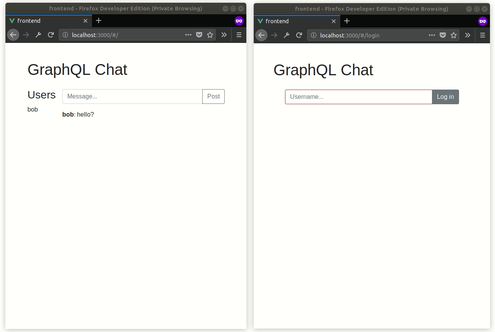

This article shows how to build a simple real-time chat using GraphQL and Go. The GraphQL server is implemented with [vektah/gqlgen](https://github.com/vektah/gqlgen) package and uses Redis to store the state. The front-end app is made with Vue and uses Apollo client libraries to communicate with the server.

Full source code is available on [GitHub](https://github.com/tinrab/graphql-realtime-chat).

# Getting started

Set up [Docker](https://docs.docker.com/install/) and [Docker Compose](https://docs.docker.com/compose/install/). You also need Go with [vgo](https://github.com/golang/vgo/) and [vektah/gqlgen](https://github.com/vektah/gqlgen) packages.

# GraphQL schema

GraphQL schema is defined as follows:

[server/schema.graphql](https://github.com/tinrab/graphql-realtime-chat/blob/master/server/schema.graphql)

```graphql
scalar Time

type Message {
  id: String!
  user: String!
  createdAt: Time!
  text: String!
}

type Mutation {
  postMessage(user: String!, text: String!): Message
}

type Query {
  messages: [Message!]!
  users: [String!]!
}

type Subscription {
  messagePosted(user: String!): Message!
  userJoined(user: String!): String!
}
```

The schema is very simple. A user is just a string, which represents its name. There's a single mutation for posting a message. Two subscriptions enable listening for new messages and seeing when someone joins the chat. It's also possible to query for all users and messages.

Schema file is references inside [server/graphql.go](https://github.com/tinrab/graphql-realtime-chat/blob/master/server/graphql.go) file.

```go
//go:generate gqlgen -schema ./schema.graphql
package server
```

GraphQL implementation can be generated with the following command:

```bash
go generate server/graphql.go
```

# Server

Server needs to communicate with Redis and serve GraphQL operations.

[server/graphql.go](https://github.com/tinrab/graphql-realtime-chat/blob/master/server/graphql.go)

```go
type graphQLServer struct {
  redisClient     *redis.Client
  messageChannels map[string]chan Message
  userChannels    map[string]chan string
  mutex           sync.Mutex
}

func NewGraphQLServer(redisURL string) (*graphQLServer, error) {
  client := redis.NewClient(&redis.Options{
    Addr: redisURL,
  })

  retry.ForeverSleep(2*time.Second, func(_ int) error {
    _, err := client.Ping().Result()
    return err
  })
  return &graphQLServer{
    redisClient:     client,
    messageChannels: map[string]chan Message{},
    userChannels:    map[string]chan string{},
    mutex:           sync.Mutex{},
  }, nil
}
```

To run it, enable all origins on the handler (CORS) and for the WebSocket upgrader. A GraphQL playground will also be available on `http://localhost:8080/playground`.

```go
func (s *graphQLServer) Serve(route string, port int) error {
  mux := http.NewServeMux()
  mux.Handle(
    route,
    handler.GraphQL(MakeExecutableSchema(s),
      handler.WebsocketUpgrader(websocket.Upgrader{
        CheckOrigin: func(r *http.Request) bool {
          return true
        },
      }),
    ),
  )
  mux.Handle("/playground", handler.Playground("GraphQL", route))

  handler := cors.AllowAll().Handler(mux)
  return http.ListenAndServe(fmt.Sprintf(":%d", port), handler)
}
```

This wont work yet, because resolvers aren't implemented for `graphQLServer` struct.

## Queries

Querying for messages involves fetching data from a Redis [list](https://redis.io/commands#list). The `LRANGE` command used below will return all messages.

```go
func (s *graphQLServer) Query_messages(ctx context.Context) ([]Message, error) {
  cmd := s.redisClient.LRange("messages", 0, -1)
  if cmd.Err() != nil {
    log.Println(cmd.Err())
    return nil, cmd.Err()
  }
  res, err := cmd.Result()
  if err != nil {
    log.Println(err)
    return nil, err
  }
  messages := []Message{}
  for _, mj := range res {
    var m Message
    err = json.Unmarshal([]byte(mj), &m)
    messages = append(messages, m)
  }
  return messages, nil
}
```

Because users have to be unique, a [set](https://redis.io/commands#set) is used instead.

```go
func (s *graphQLServer) Query_users(ctx context.Context) ([]string, error) {
  cmd := s.redisClient.SMembers("users")
  if cmd.Err() != nil {
    log.Println(cmd.Err())
    return nil, cmd.Err()
  }
  res, err := cmd.Result()
  if err != nil {
    log.Println(err)
    return nil, err
  }
  return res, nil
}
```

## Mutation

For a user to post a message, it must first be inserted into Redis, then pushed to all clients that are subscribed to `messagePosted` subscription. A user will also be considered as "joined" after its first message. The code below is insecure, because somebody could overwrite any user's name.

```go
func (s *graphQLServer) Mutation_postMessage(ctx context.Context, user string, text string) (*Message, error) {
  err := s.createUser(user)
  if err != nil {
    return nil, err
  }

  // Notify new user joined
  s.mutex.Lock()
  for _, ch := range s.userChannels {
    ch <- user
  }
  s.mutex.Unlock()
  // Create message
  m := Message{
    ID:        ksuid.New().String(),
    CreatedAt: time.Now().UTC(),
    Text:      text,
    User:      user,
  }
  mj, _ := json.Marshal(m)
  if err := s.redisClient.LPush("messages", mj).Err(); err != nil {
    log.Println(err)
    return nil, err
  }
  // Notify new message
  s.mutex.Lock()
  for _, ch := range s.messageChannels {
    ch <- m
  }
  s.mutex.Unlock()
  return &m, nil
}
```

Here's a convenience function for creating a user.

```go
func (s *graphQLServer) createUser(user string) error {
  // Upsert user
  if err := s.redisClient.SAdd("users", user).Err(); err != nil {
    return err
  }
  // Notify new user joined
  s.mutex.Lock()
  for _, ch := range s.userChannels {
    ch <- user
  }
  s.mutex.Unlock()
  return nil
}
```

Possible improvement: implement secure log-in system.

## Subscriptions

Implementation for `messagePosted` subscription involves creating a new channel and returning it. The generated GraphQL code will then use this channel to push events to clients using WebSockets.

```go
func (s *graphQLServer) Subscription_messagePosted(ctx context.Context, user string) (<-chan Message, error) {
  err := s.createUser(user)
  if err != nil {
    return nil, err
  }

  // Create new channel for request
  messages := make(chan Message, 1)
  s.mutex.Lock()
  s.messageChannels[user] = messages
  s.mutex.Unlock()

  // Delete channel when done
  go func() {
    <-ctx.Done()
    s.mutex.Lock()
    delete(s.messageChannels, user)
    s.mutex.Unlock()
  }()

  return messages, nil
}
```

The `userJoined` subscription is similar, but uses another map of channels.

```go
func (s *graphQLServer) Subscription_userJoined(ctx context.Context, user string) (<-chan string, error) {
  err := s.createUser(user)
  if err != nil {
    return nil, err
  }

  // Create new channel for request
  users := make(chan string, 1)
  s.mutex.Lock()
  s.userChannels[user] = users
  s.mutex.Unlock()

  // Delete channel when done
  go func() {
    <-ctx.Done()
    s.mutex.Lock()
    delete(s.userChannels, user)
    s.mutex.Unlock()
  }()

  return users, nil
}
```

# Client

The front-end Vue app is located inside 
[frontend](https://github.com/tinrab/graphql-realtime-chat/tree/master/frontend) directory.

It uses [Akryum/vue-apollo](https://github.com/Akryum/vue-apollo) library to communicate with the GraphQL server. The set up requires specifying both the HTTP URL and WebSockets URL of the server. Client then decides what protocol to use based on the GraphQL operation type.

[frontend/src/main.js](https://github.com/tinrab/graphql-realtime-chat/blob/master/frontend/src/main.js)
```js
const httpLink = new HttpLink({
  uri: 'http://localhost:8080/graphql',
});
const wsLink = new WebSocketLink({
  uri: 'ws://localhost:8080/graphql',
  options: {
    reconnect: true,
  },
});
const link = split(
  ({ query }) => {
    const { kind, operation } = getMainDefinition(query);
    return kind === 'OperationDefinition' && operation === 'subscription';
  },
  wsLink,
  httpLink,
);
const apolloClient = new ApolloClient({
  link: link,
  cache: new InMemoryCache(),
});
const apolloProvider = new VueApollo({
  defaultClient: apolloClient,
});

Vue.use(VueApollo);
```

Messages are rendered inside [frontend/src/components/MessageList.vue](https://github.com/tinrab/graphql-realtime-chat/blob/master/frontend/src/components/MessageList.vue) file.

```html
<template>
  <div>
    <app-message v-for="message of messages"
                 :key="message.id"
                 :message="message">
    </app-message>
  </div>
</template>
```

They are fetched from the server using "subscribeToMore" pattern.

First, the default data needs to be set.

```js
<script>
import gql from 'graphql-tag';
import Message from '@/components/Message';

export default {
  components: {
    'app-message': Message,
  },
  data() {
    return {
      messages: [],
    };
  },
  // ...
}
</script>
```

Then initial data is fetched with a query.

```js
// ...
apollo: {
  messages() {
    const user = this.$currentUser();
    return {
      query: gql`
        {
          messages {
            id
            user
            text
            createdAt
          }
        }
      `,
      subscribeToMore: {
        // ...
      },
    };
  },
},
// ...
```

Finally, the component is subscribed to changes inside `subscribeToMore` object.

```js
document: gql`
  subscription($user: String!) {
    messagePosted(user: $user) {
      id
      user
      text
      createdAt
    }
  }
`,
variables: () => ({ user: user }),
updateQuery: (prev, { subscriptionData }) => {
  if (!subscriptionData.data) {
    return prev;
  }
  const message = subscriptionData.data.messagePosted;
  if (prev.messages.find((m) => m.id === message.id)) {
    return prev;
  }
  return Object.assign({}, prev, {
    messages: [message, ...prev.messages],
  });
},
```

Showing active users ([frontend/src/components/UserList.vue](https://github.com/tinrab/graphql-realtime-chat/blob/master/frontend/src/components/UserList.vue)) is very similar. One thing to look out for is displaying duplicates. They get filtered out in the `updateQuery` function.

# Running

To run the app, define the `Dockerfile` file.

[Dockerfile](https://github.com/tinrab/graphql-realtime-chat/blob/master/Dockerfile)

```dockerfile
FROM golang:1.10.2-alpine3.7 AS build
RUN apk --no-cache add gcc g++ make git ca-certificates
RUN go get -u -v golang.org/x/vgo

WORKDIR /go/src/github.com/tinrab/graphql-realtime-chat
COPY go.mod .
COPY vendor vendor
COPY server server
COPY main.go .
RUN vgo build -o /go/bin/app .

FROM alpine:3.7
WORKDIR /usr/bin
COPY --from=build /go/bin .
EXPOSE 8080
CMD ["app"]
```

They specify its path inside [docker-compose.yaml](https://github.com/tinrab/graphql-realtime-chat/blob/master/docker-compose.yaml), along with a Redis container.

```yaml
version: "3.6"

services:
  app:
    build: .
    environment:
      REDIS_URL: "redis:6379"
    ports:
      - "8080:8080"
  redis:
    image: "redis:4.0.9"
```

Build and run server:

```bash
vgo mod -vendor
docker-compose up -d
```

Run the Vue app:

```bash
cd frontend
yarn serve
```

Final result looks like this:



# Wrapping up

You can find entire project on [GitHub](https://github.com/tinrab/graphql-realtime-chat).
