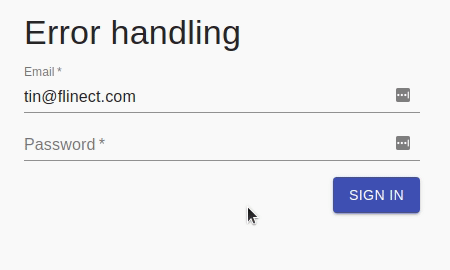
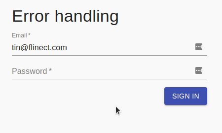

Here's a pattern I've been using to deal with failure states on request/response type actions when using Redux with [Redux-Saga](https://redux-saga.js.org/).

Source code is available on [GitHub](https://github.com/tinrab/react-patterns).

# Action transactions

We need a way to track state across request and response actions.
Let `Transaction` class hold the state of a transaction, which can be *in progress*, end in *failure*, or end *successfully*.

```ts
export class Transaction {
  private constructor(
    private readonly _started: boolean,
    private readonly _done: boolean,
    public readonly error?: ActionError,
  ) {}

  public get ok(): boolean {
    return this._started && this._done && !this.error;
  }

  public static create(): Transaction {
    return new Transaction(false, false);
  }

  public static start(): Transaction {
    return new Transaction(true, false);
  }

  public static finish(error?: ActionError): Transaction {
    return new Transaction(true, true, error);
  }
}
```

We also declare the result type.

```ts
export enum ErrorCode {
  IncorrectCredentials = 1,
}

export type ActionError = {
  code: ErrorCode;
  message: string;
};

export type ActionResult<T> =
  | { error: ActionError }
  | ({ error: undefined } & T);
```

Additionally, `Transaction` class could hold any other response data, such as status or HTTP headers.

# Redux actions

As an example, let's declare two types of Redux actions.
One for making a request, and another that holds its result.

```ts
export enum UserActionType {
  SignIn = 'user/sign-in',
  SignInResult = 'user/sign-in-result',
}

export type SignInUserAction = {
  type: UserActionType.SignIn;
  payload: {
    email: string;
    password: string;
  };
};

export type SignInResultUserAction = {
  type: UserActionType.SignInResult;
  payload: ActionResult<UserData>;
};

export type UserAction = SignInUserAction | SignInResultUserAction;
```

Here are creator functions for these actions.

```ts
export const userActions = {
  signIn: (email: string, password: string): SignInUserAction => ({
    type: UserActionType.SignIn,
    payload: { email, password },
  }),
  signInResult: (result: ActionResult<UserData>): SignInResultUserAction => ({
    type: UserActionType.SignInResult,
    payload: result,
  }),
};
```

# Redux reducer

The state contains a transaction object for each request.

```ts
export type UserState = {
  currentUser?: UserData;
  signInTransaction: Transaction;
};

const initialState: UserState = {
  signInTransaction: Transaction.create(),
};
```

Here are some helper selectors for the user's state.

```ts
export const userSelectors = {
  currentUser: (state: AppState): UserData | undefined =>
    state.user.currentUser,
  signInTransaction: (state: AppState): Transaction =>
    state.user.signInTransaction,
};
```

We need to handle `SignIn` and `SignInResult` actions and update the transaction state accordingly.

```ts
export default function userReducer(
  state: UserState = initialState,
  action: UserAction,
): UserState {
  switch (action.type) {
    case UserActionType.SignIn:
      return { ...state, signInTransaction: Transaction.start() };
    case UserActionType.SignInResult:
      if (action.payload.error) {
        return {
          ...state,
          signInTransaction: Transaction.finish(action.payload.error),
        };
      } else {
        return {
          ...state,
          currentUser: action.payload,
          signInTransaction: Transaction.finish(),
        };
      }
    default:
      return state;
  }
}
```

Upon failure, `signInTransaction` will contain the error object.

# Saga

We'll perform the sign-in request on `SignIn` action and redirect to a home page on successful `SignInResult` action.

```ts
export function* userSaga(): Generator {
  yield all([
    takeLatest(UserActionType.SignIn, handleSignIn),
    takeLatest(UserActionType.SignInResult, handleSignInResult),
  ]);
}
```

The important part is to dispatch `SignInResult` action with appropriate `ActionResult<UserData>` payload.
Handling could involve calling the API within a try-catch block, and setting result's error property on failure.

```ts
function* handleSignIn(action: SignInUserAction): Generator {
  const { email, password } = action.payload;

  const user: UserData = { id: '1', email: 'tin@flinect.com' };

  if (email != user.email || password != '123456') {
    yield put(
      userActions.signInResult({
        error: {
          code: ErrorCode.IncorrectCredentials,
          message: 'Incorrect credentials.',
        },
      }),
    );
    return;
  }

  yield put(userActions.signInResult({ error: undefined, ...user }));
}
```

We handle `SignInResult` separately.

```ts
function* handleSignInResult(action: SignInResultUserAction): Generator {
  if (!action.payload.error) {
    yield call(history.push, routerPaths.errorHandlingHome);
  }
}
```

# Hooking up

In a component, we get the state for `signInTransaction`.

```tsx
const ErrorHandlingPattern: React.FC = () => {
  const dispatch = useDispatch();
  const signInTransaction = useSelector(userSelectors.signInTransaction);
  const signInError = signInTransaction.error;
  // ...
}
```

Then display possible error message.

```tsx
// ...
{signInError && <Alert severity="error">{signInError.message}</Alert>}
// ...
```

And dispatch the `SignIn` action when the user clicks the "sign in" button.

```tsx
// ...
const handleSubmit = (event: FormEvent): void => {
  event.preventDefault();
  dispatch(userActions.signIn(email, password));
};
// ...
```

Sometimes you're dealing with dialogs that need to stay open on failure, or close on success.
This can be achieved by closing the dialog if transaction is successful (`signInTransaction.ok`).

If dialog displays an error and is closed, the `ResetTransactions` ensures that previous error is cleared before showing it again.

```tsx
useEffect(() => {
  if (signInTransaction.ok) {
    setSignInDialogOpen(() => false);
    dispatch(userActions.resetTransactions());
  }
}, [signInTransaction]);
```

# Conclusion

Here's an example of entering incorrect credentials.



If sign-in succeeds, user is redirected as expected.



Source code is available on [GitHub](https://github.com/tinrab/react-patterns).
