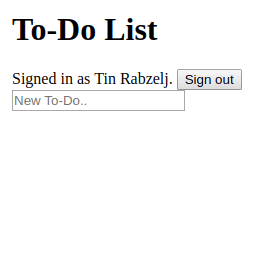

In the first part ([Build a Todo List with Angular and Google App Engine - Part 1](/todo-list-angular-google-app-engine-part-1)) you have created a Google App Engine back-end service. Now it's time to make an app interacting with it.

# Getting started

Create a new Angular project.

```
$ ng new $PROJECT_NAME --style=scss --routing=true --skip-commit=true
```

Run development server, preferably in the background.

```
$ ng serve &
```

Navigate to <http://localhost:4200> with your browser. Also keep the App Engine server running.

# Signing in

Update `environment.ts` file inside `environments` directory. 

```typescript
export const environment = {
  production: false,
  clientId: '[CLIENT_ID]',
  apiUrl: 'http://localhost:8080/api'
};
```

And for production file `environment.prod.ts` change the `apiUrl` value.

```typescript
export const environment = {
  production: true,
  clientId: '[CLIENT_ID]',
  apiUrl: '/api'
};
```

## Authentication service

Create the user model class.

```
$ ng g class user.model
```

Locate `user.model.ts` file and write a constructor with some parameter properties.

```typescript
export class User {
  constructor(
    public id: string,
    public sessionToken: string,
    public displayName: string
  ) { }
}
```

Import Google API library in the head section inside `index.html`.

```html
<script src="https://apis.google.com/js/api.js"></script>
```

Create the authentication service.

```
$ ng g service auth
```

Add some imports inside `auth.service.ts` and declare the `gapi` variable. This is necessary for making compilation succeed, because the actual `gapi` variable wont be set until browser fetches the Google API library.

```typescript
import { Injectable } from '@angular/core';
import { HttpClient, HttpHeaders } from '@angular/common/http';
import { environment } from '../environments/environment';
import { User } from './user.model';

declare const gapi: any;

@Injectable()
export class AuthService { }
```

Add an import for `HttpClientModule` and a provider for your authentication service inside `app.module.ts` file.

```typescript{3,6,13,16}
import { BrowserModule } from '@angular/platform-browser';
import { NgModule } from '@angular/core';
import { HttpClientModule } from '@angular/common/http';
import { AppRoutingModule } from './app-routing.module';
import { AppComponent } from './app.component';
import { AuthService } from './auth.service';
@NgModule({
  declarations: [
    AppComponent
  ],
  imports: [
    BrowserModule,
    HttpClientModule,
    AppRoutingModule
  ],
  providers: [AuthService],
  bootstrap: [AppComponent]
})
export class AppModule { }
```

Load Google API library in the constructor of `AuthService`.

```typescript
private googleAuth: any;
private user: User;

constructor(private http: HttpClient) {
  gapi.load('client:auth2', () => {
    gapi.client.init({
      'clientId': environment.clientId,
      'scope': 'profile'
    }).then(() => {
      this.googleAuth = gapi.auth2.getAuthInstance();
      const googleUser = this.googleAuth.currentUser.get();
      // Get user's data if he's signed in
      if (googleUser) {
        this.user = JSON.parse(localStorage.getItem('user'));
      }
    });
  });
}
```

To sign in, first authenticate a user with Google, then with your back-end service.

Declare the `SignInResponse` interface outside of `AuthService` class.

```typescript
interface SignInResponse {
  userId: string;
  sessionToken: string;
}
```

Write the `signIn` function.

```typescript
signIn(): Promise<User> {
  return new Promise<User>((resolve, reject) => {
    this.googleAuth.signIn({
      // Show the prompt
      'prompt': 'consent'
    }).then(googleUser => {
      // Get Google ID token
      const token = googleUser.getAuthResponse().id_token;
      // Sign in with the back-end service
      this.http.post<SignInResponse>(`${environment.apiUrl}/signin`, null, {
        headers: new HttpHeaders().set('Authorization', token)
      }).subscribe(res => {
        const profile = googleUser.getBasicProfile();
        // Create the user
        this.user = new User(res.userId, res.sessionToken, profile.getName());
        // Save the user to local storage
        localStorage.setItem('user', JSON.stringify(this.user));
        resolve(this.user);
      }, reject);
    }, reject);
  });
}
```

Signing out is a bit simpler.

```typescript
signOut(): void {
  localStorage.removeItem('user');
  this.user = null;
  this.googleAuth.signOut();
}
```

Write utility functions for getting the sign-in state.

```typescript
get currentUser(): User {
  if (!this.user) {
    this.user = JSON.parse(localStorage.getItem('user'));
  }
  return this.user;
}

get isSignedIn(): boolean {
  return this.currentUser != null;
}
```

If user refreshes the page, he'll remain signed-in, because the old instance of `User` class is parsed from local storage.

## Routing

Create two new components.

```
$ ng g component sign-in
$ ng g component list
```

The sign-in component will act as a sign-in page, and list component is where the todo list is displayed. You can navigate to the list component only if you're signed-in, therefore it must be protected.

Create a guard for preventing unauthenticated access.

```
$ ng g guard auth
```

Check the sign-in state inside `canActivate` function in the `auth.guard.ts` file. If the user is not signed in, redirect him to the sign-in page.

```typescript
import { Injectable } from '@angular/core';
import { Router, CanActivate, ActivatedRouteSnapshot, RouterStateSnapshot } from '@angular/router';
import { Observable } from 'rxjs/Observable';
import { AuthService } from './auth.service';

@Injectable()
export class AuthGuard implements CanActivate {
  constructor(
    private router: Router,
    private authService: AuthService
  ) { }
  canActivate(
    next: ActivatedRouteSnapshot,
    state: RouterStateSnapshot): Observable<boolean> | Promise<boolean> | boolean {
    if (this.authService.isSignedIn) {
      return true;
    }
    this.router.navigateByUrl('signin');
    return false;
  }
}
```

Now connect all routes inside the routing module file `app-routing.module.ts`.

```typescript
import { NgModule } from '@angular/core';
import { Routes, RouterModule } from '@angular/router';
import { SignInComponent } from './sign-in/sign-in.component';
import { ListComponent } from './list/list.component';
import { AuthGuard } from './auth.guard';
const routes: Routes = [
  {
    path: '',
    children: [{
      path: 'signin',
      component: SignInComponent
    }, {
      path: '',
      component: ListComponent,
      canActivate: [AuthGuard]
    }]
  }
];
@NgModule({
  imports: [RouterModule.forRoot(routes)],
  exports: [RouterModule],
  providers: [AuthGuard]
})
export class AppRoutingModule { }
```

## Sign-in flow

Make a basic sign-in page in the `sign-in.component.html` template file.

```html
<h1>To-Do List</h1>
<button (click)="signIn()">Sign in</button>
```

Write the `signIn` function inside `sign-in.component.ts`.

```typescript
import { Component } from '@angular/core';
import { Router } from '@angular/router';
import { AuthService } from '../auth.service';
@Component({
  selector: 'app-sign-in',
  templateUrl: './sign-in.component.html',
  styleUrls: ['./sign-in.component.scss']
})
export class SignInComponent {
  constructor(
    private router: Router,
    private authService: AuthService
  ) { }
  signIn(): void {
    this.authService.signIn()
      .then(_ => this.router.navigateByUrl(''))
      .catch(error => console.log(error));
  }
}
```

If signing in succeeds, redirect the user to the home page.

Show user's name and a sign-out button in the `list.component.html` template file.

```html
<p>Hey, {{user.displayName}}</p>
<button (click)="signOut()">Sign out</button>
```

Update the `list.component.ts` file.

```typescript
import { Component } from '@angular/core';
import { Router } from '@angular/router';
import { AuthService } from '../auth.service';
import { User } from '../user.model';

@Component({
  selector: 'app-list',
  templateUrl: './list.component.html',
  styleUrls: ['./list.component.scss']
})
export class ListComponent {
  user: User;
  constructor(
    private router: Router,
    private authService: AuthService
  ) {
    this.user = this.authService.currentUser;
  }
  signOut(): void {
    this.authService.signOut();
    this.router.navigateByUrl('signin');
  }
}
```

Now, try signing in.

# Todo service

You need another service to handle operations with todos.

Create the todo model class.

```
$ ng g class todo.model
```

Define some properties.

```typescript
export class Todo {
  constructor(
    public id: string,
    public createdAt: Date,
    public title: string
  ) { }
}
```

Create the todo service.

```
$ ng g service todo
```

Locate `todo.service.ts` file and add some imports.

```typescript
import { Injectable } from '@angular/core';
import { HttpClient, HttpHeaders } from '@angular/common/http';
import 'rxjs/add/operator/map';
import 'rxjs/add/operator/toPromise';
import { environment } from '../environments/environment';
import { Todo } from './todo.model';
import { User } from './user.model';
import { AuthService } from './auth.service';

@Injectable()
export class TodoService { }
```

Add `TodoService` to the providers array inside `app.module.ts`.

```typescript{1,13}
import { TodoService } from './todo.service';
@NgModule({
  declarations: [
    AppComponent,
    SignInComponent,
    ListComponent
  ],
  imports: [
    BrowserModule,
    HttpClientModule,
    AppRoutingModule
  ],
  providers: [AuthService, TodoService],
  bootstrap: [AppComponent]
})
export class AppModule { }
```

Write a constructor for `TodoService`.

```typescript
private user: User;
private headers: HttpHeaders;
constructor(
  private authService: AuthService,
  private http: HttpClient
) {
  this.user = authService.currentUser;
  this.headers = new HttpHeaders({
    'Accept': 'application/json',
    'Content-Type': 'application/json',
    'Authorization': this.user.sessionToken
  });
}
```

This service will perform authenticated calls by setting the `Authorization` header, and for that, a property `headers` is declared for convenience.

Write functions for creating, reading, updating and deleting todos.

```typescript
createTodo(title: string): Promise<Todo> {
  return this.http.post<Todo>(
    `${environment.apiUrl}/todos`,
    { title: title },
    { headers: this.headers }
  ).toPromise();
}

listTodos(): Promise<Todo[]> {
  return this.http.get<Todo[]>(
    `${environment.apiUrl}/todos`,
    { headers: this.headers }
  ).toPromise();
}

updateTodo(id: string, title: string): Promise<Todo> {
  return this.http.post<Todo>(
    `${environment.apiUrl}/todos/${id}`,
    { title: title },
    { headers: this.headers }
  ).toPromise();
}

deleteTodo(id: string): Promise<void> {
  return this.http.delete<Todo>(
    `${environment.apiUrl}/todos/${id}`,
    { headers: this.headers }
  ).map(_ => { })
    .toPromise();
}
```

# Todo list

Time to display the todo list.

Create the todo component.

```
$ ng g component todo
```

Add an input property inside `todo.component.ts` to hold the todo model.

```typescript{1,10-11}
import { Component, Input } from '@angular/core';
import { Todo } from '../todo.model';

@Component({
  selector: 'app-todo',
  templateUrl: './todo.component.html',
  styleUrls: ['./todo.component.scss']
})
export class TodoComponent {
  @Input()
  item: Todo;
  constructor() { }
}
```

Display todo's title in the template.

```html
<p>
  {{item.title}}
</p>
```

To display todos in a list, call the service inside a `ngAfterViewInit` lifecycle hook and set resulting data to a `todos` property.

```typescript{1,5-6,13,15,19,23-26}
import { Component, AfterViewInit } from '@angular/core';
import { Router } from '@angular/router';
import { AuthService } from '../auth.service';
import { User } from '../user.model';
import { TodoService } from '../todo.service';
import { Todo } from '../todo.model';

@Component({
  selector: 'app-list',
  templateUrl: './list.component.html',
  styleUrls: ['./list.component.scss']
})
export class ListComponent implements AfterViewInit {
  user: User;
  todos: Todo[];
  constructor(
    private router: Router,
    private authService: AuthService,
    private todoService: TodoService
  ) {
    this.user = this.authService.currentUser;
  }
  ngAfterViewInit(): void {
    this.todoService.listTodos()
    .then(todos => this.todos = todos);
  }
  signOut(): void {
    this.authService.signOut();
    this.router.navigateByUrl('signin');
  }
}
```

Then update the `list.component.html` template.

```html
<h1>To-Do List</h1>
<div>
  Signed in as {{user.displayName}}.
  <button (click)="signOut()">Sign out</button>
</div>
<ul>
  <li *ngFor="let todo of todos">
    <app-todo [item]="todo"></app-todo>
  </li>
</ul>
```

Sign in and observe your list of todos.

## Creating todos

First off, import `FormsModule` inside your root module.

```typescript{1,11}
import { FormsModule } from '@angular/forms';
@NgModule({
  declarations: [
    AppComponent,
    SignInComponent,
    ListComponent,
    TodoComponent
  ],
  imports: [
    BrowserModule,
    FormsModule,
    HttpClientModule,
    AppRoutingModule
  ],
  providers: [AuthService, TodoService],
  bootstrap: [AppComponent]
})
```

Write a function inside `list.component.ts` which calls the todo service. The `newTodoTitle` property will hold entered value.

```typescript
newTodoTitle: string;

createTodo(): void {
  const title = this.newTodoTitle.trim();
  if (title) {
    this.todoService.createTodo(title)
    .then(todo => this.todos.unshift(todo));
    // Reset input's value if successful
    this.newTodoTitle = '';
  }
}
```

Add an input element inside `list.component.html`. Bind its value to the `newTodoTitle` property and call `createTodo` function, if enter key is pressed.

```html
<div>
  <input type="text"
         placeholder="New To-Do.."
         [(ngModel)]="newTodoTitle"
         (keyup.enter)="createTodo()">
</div>
```

Now try creating a few todos.

## Updating todos

The user will be able to update todo's title by clicking on it, and entering a new value into the shown input field.

Update the todo component's template file.

```html
<div>
  <span *ngIf="!editMode; else titleInput"
        (click)="onTitleClick()">{{item.title}}</span>
  <ng-template #titleInput>
    <input type="text"
           [(ngModel)]="editableTitle"
           (keyup.enter)="update()"
           (blur)="onTitleInputBlur()">
  </ng-template>
</div>
```

Add some properties and write a couple of functions in `todo.component.ts`.

```typescript{4-5,16-19,21,23-35}
import {
  Component,
  Input,
  Output,
  EventEmitter
} from '@angular/core';
import { Todo } from '../todo.model';
@Component({
  selector: 'app-todo',
  templateUrl: './todo.component.html',
  styleUrls: ['./todo.component.scss']
})
export class TodoComponent {
  @Input()
  item: Todo;
  @Output()
  updateRequest: EventEmitter<string>;
  editMode: boolean;
  editableTitle: string;
  constructor() {
    this.updateRequest = new EventEmitter<string>();
  }
  update(): void {
    if (this.editMode) {
      this.editMode = false;
      this.updateRequest.emit(this.editableTitle);
    }
  }
  onTitleClick(): void {
    this.editMode = true;
    this.editableTitle = this.item.title;
  }
  onTitleInputBlur(): void {
    this.editMode = false;
  }
}
```

An update request is send to the parent list component. Update `list.component.html` by binding `updateRequest` to a handler function. Variable `$event` will hold the new title.

```html
<app-todo [item]="todo"
          (updateRequest)="updateTodo(todo, $event)">
</app-todo>
```

Write the `updateTodo` function inside `list.component.ts`.

```typescript
updateTodo(todo: Todo, title: string): void {
  title = title.trim();
  if (title.length !== 0 && todo.title !== title) {
    this.todoService.updateTodo(todo.id, title)
    .then(_ => todo.title = title);
  }
}
```

## Deleting todos

Add a delete button to todo's template.

```html
<button (click)="delete()"
        [disabled]="editMode">x</button>
```

Update `todo.component.ts` to handle the deletion. This is similar as updating.

```typescript{3-4,7,10-12}
export class TodoComponent {
  // ...
  @Output()
  deleteRequest: EventEmitter<void>;
  constructor() {
    // ...
    this.deleteRequest = new EventEmitter<void>();
  }
  // ...
  delete(): void {
    this.deleteRequest.emit();
  }
}
```

Bind delete request to the delete handler inside list component's template.

```html{3}
<app-todo [item]="todo"
          (updateRequest)="updateTodo(todo, $event)"
          (deleteRequest)="deleteTodo(todo)">
</app-todo>
```

Write the delete function inside `list.component.ts`.

```typescript
deleteTodo(todo: Todo): void {
  this.todoService.deleteTodo(todo.id)
  .then(() => this.todos = this.todos.filter(e => e.id !== todo.id));
}
```

To prevent Angular having to re-create all DOM elements when data changes, define a `trackBy` function at the `ngFor` directive.

```html
<li *ngFor="let todo of todos; trackBy: trackByTodos">
```

Now declare the `trackByTodos` function inside `list.component.ts`.

```typescript
trackByTodos(index: string, todo: Todo): string {
  return todo.id;
}
```

# Making it look good

At this point, your To-Do app should look as awesome as this.



You can make it look even better with [Angular Material](https://material.angular.io/). First off, install some dependencies.

```
$ npm install --save @angular/material @angular/cdk @angular/animations normalize.css
```

Import necessary modules inside `app.module.ts`.

```typescript
// ...
import { BrowserAnimationsModule } from '@angular/platform-browser/animations';
import {
  MdButtonModule,
  MdInputModule,
  MdListModule,
  MdIconModule,
  MdToolbarModule
} from '@angular/material';

@NgModule({
  imports: [
    // ...
    BrowserAnimationsModule,
    MdButtonModule,
    MdInputModule,
    MdListModule,
    MdIconModule,
    MdToolbarModule
    // ...
  ]
})
export class AppModule { }
```

Import Roboto font and material icons inside `index.html`.

```html
<link href="https://fonts.googleapis.com/css?family=Roboto:300,400,500" rel="stylesheet">
<link href="https://fonts.googleapis.com/icon?family=Material+Icons" rel="stylesheet">
```

Locate `styles.scss` file and add the following imports.

```scss
@import "~normalize.css";
@import "~@angular/material/prebuilt-themes/indigo-pink.css";
```

Update `app.component.html`.

```html
<md-toolbar>To-Do List</md-toolbar>
<div class="mat-typography">
  <router-outlet>
  </router-outlet>
</div>
```

Make a welcoming sign-in page in the `sign-in.component.html` file.

```html
<h1>Welcome to To-Do List!</h1>
<button md-raised-button
        class="sign-in-button"
        color="primary"
        (click)="signIn()">Sign in</button>
```

And in `sign-in.component.scss`.

```scss
:host {
  display: block;
  box-sizing: border-box;
  padding: 32px 16px;
  text-align: center;
}
```

Update list component's template `list.component.html`.

```html
<div class="user">
  Signed in as {{user.displayName}}.
  <button md-button
          class="user__sign-out"
          (click)="signOut()">Sign out</button>
</div>
<div>
  <md-form-field class="new-todo-field">
    <input mdInput
           type="text"
           placeholder="New To-Do.."
           [(ngModel)]="newTodoTitle"
           (keyup.enter)="createTodo()">
  </md-form-field>
</div>
<md-list>
  <app-todo *ngFor="let todo of todos; trackBy: trackByTodos"
            [item]="todo"
            (updateRequest)="updateTodo(todo, $event)"
            (deleteRequest)="deleteTodo(todo)"></app-todo>
</md-list>
```

And its style sheet `list.component.scss`.

```scss
:host {
  display: block;
  box-sizing: border-box;
  width: 400px;
  max-width: 100%;
  margin: 0 auto;
  padding: 32px 16px;
}
.user {
  display: flex;
  align-items: center;
  margin-bottom: 16px;
  &__sign-out {
    margin-left: auto;
  }
}
.new-todo-field {
  width: 100%;
}
```

Update the `todo.component.html`.

```html
<md-list-item>
  <span md-line
        *ngIf="!editMode; else titleInput"
        (click)="onTitleClick()">{{item.title}}</span>
  <ng-template #titleInput>
    <md-form-field class="title-input">
      <input mdInput
             type="text"
             [(ngModel)]="editableTitle"
             (keyup.enter)="update()"
             (blur)="onTitleInputBlur()">
    </md-form-field>
  </ng-template>
  <button md-icon-button
          (click)="delete()"
          [disabled]="editMode">
    <md-icon class="md-24">done</md-icon>
  </button>
</md-list-item>
```

Add a tiny tweak to `todo.component.scss`.

```scss
.title-input {
  width: 100%;
}
```

Your app should now look like this.


# Deploying

Set up handlers for static content inside the `app.yaml` of your Google App Engine project.

```yaml
runtime: go
api_version: go1
handlers:
- url: /(signin)?
  static_files: static/index.html
  upload: static/index.html
- url: /(.*\.(css|gif|png|jpg|ico|js|html))
  static_files: static/\1
  upload: static/(.*\.(css|gif|png|jpg|ico|js|html))
- url: /.*
  script: _go_app
env_variables:
  CLIENT_ID: '[CLIENT_ID]'
```

Modify the `build` script and add a `deploy` script inside `package.json`.

```json{3-4}
{
  "scripts": {
    "build": "ng build --target=production --output-path=./server/static",
    "deploy": "gcloud app deploy --project=${PROJECT_ID} server/app.yaml server/index.yaml",
  }
}
```

Above setup assumes your Google App Engine project is located inside `server` directory.

Now build the app and deploy it.

```
$ export PROJECT_ID=[PROJECT_ID]
$ npm run build && npm run deploy
```

Replace `[PROJECT_ID]` with your Google API Console project ID. If this is your first deployment, you'll be asked a few question.

Finally, navigate to `https://[PROJECT_ID].appspot.com` with your browser.

# Wrapping up

This concludes a two part tutorial series about making a Todo List. You can find entire source code on [GitHub](https://github.com/tinrab/todo-angular-appengine).

If you have any questions or suggestions, feel free to post them below!
