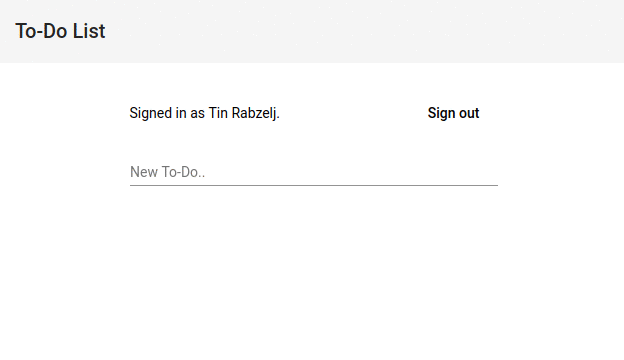

# Typography

Duis ad adipisicing reprehenderit fugiat laboris id ea aute. aaaaaaaaaaaaaaaaaaaaaaaaaaaaaaaaaaaaaaaaaaaaaaaaaaaaaaaaaaaaaaaaaaaaaaaaaaaaaaaaaaaaaaaaaaaaaaaaaaaaaaaaaaaaaaaaaaaaaaaaaaaaa

## Second

Incididunt ea do labore eiusmod eu proident nisi nostrud nostrud.

> Ipsum enim culpa culpa eiusmod ullamco tempor adipisicing ex velit ad eu dolore pariatur. Veniam commodo culpa et tempor. In labore id Lorem exercitation amet voluptate cupidatat proident laborum non anim. Incididunt do reprehenderit do irure id commodo minim ullamco.

### Third

Esse reprehenderit qui minim sunt veniam consectetur enim dolore Lorem elit.

# Code

Deserunt duis enim labore tempor `f(x, y)` eu laborum dolor. Nostrud adipisicing laborum duis qui esse quis ullamco Lorem id deserunt sunt labore. Exercitation fugiat do incididunt `System.out.println("Hello, World!")` labore enim voluptate in in.

```go{1,5-7}
func generateToken() string {
	data := make([]byte, 64)
	rand.Read(data)
	token := make([]rune, 64)
	for i := range data {
		token[i] = letters[int(data[i])%len(letters)]
	}
	return string(token)
}
```

```typescript
function lookupInUnicodeMap(code: number, map: ReadonlyArray<number>): boolean {
  // Bail out quickly if it couldn't possibly be in the map.
  if (code < map[0]) {
    return false;
  }
  // Perform binary search in one of the Unicode range maps
  let lo = 0;
  let hi: number = map.length;
  let mid: number;
  while (lo + 1 < hi) {
    mid = lo + (hi - lo) / 2;
    // mid has to be even to catch a range's beginning
    mid -= mid % 2;
    if (map[mid] <= code && code <= map[mid + 1]) {
      return true;
    }
    if (code < map[mid]) {
      hi = mid;
    }
    else {
      lo = mid + 2;
    }
  }
  return false;
}
```

```html{4-6}
<div class="post__author">
  
  <span class="post__author-info">
    <a class="post__author-name" href="http://localhost:3000/authors/tin-rabzelj" title="Tin Rabzelj">
      Tin Rabzelj
    </a>
    <span class="post__date">Sep 5, 2017</span>
  </span>
</div>
```

# Images




